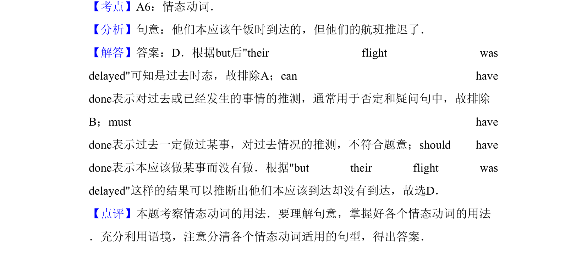

## 题面

## 摘要

单项选择，考查情态动词辨析（will/can/must/should），句意为'他们本应在午餐时抵达但航班延误'。

## 关联考点

- [[672-单项选择|单项选择]]
- [[912-语法|语法]]
- [[039-情态动词can|情态动词]]

## 答案与解析

> 📄 原 PDF 第 12 页：`素材/真题/吉林/2008-2024·（吉林）英语高考真题/2011年高考英语试卷（新课标）（解析卷）.pdf`
