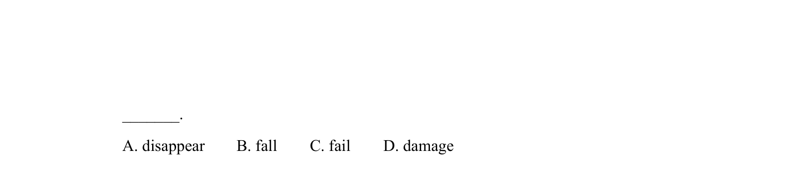
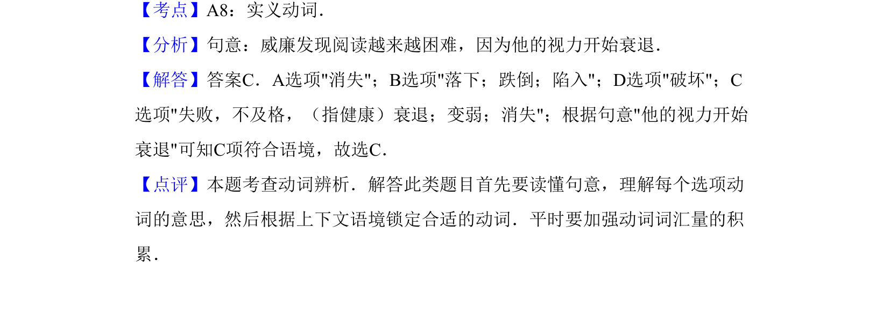

## 题面

## 摘要

本题通过新定义数列构造等比数列，并利用分组与裂项相消法求和。

## 关联考点

- [[数列递推关系]]
- [[等比数列判定]]
- [[数列分组求和]]
- [[382-数列裂项相消|裂项相消法]]

## 答案与解析

> 📄 原 PDF 第 12 页：`素材/真题/吉林/2008-2024·（吉林）英语高考真题/2011年高考英语试卷（新课标）（解析卷）.pdf`
