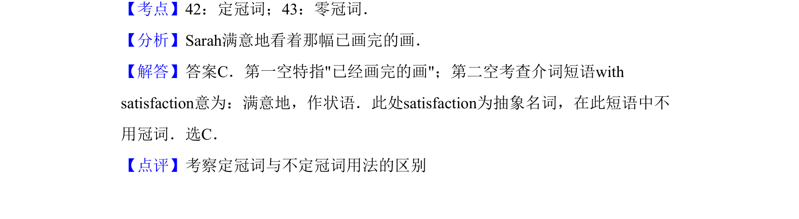

## 题面

## 摘要

考查英语定冠词与零冠词在具体语境中的辨析，特别是修饰抽象名词时的固定搭配。

## 关联考点

- [[023-定冠词the|定冠词]]
- [[929-零冠词|零冠词]]
- [[647-固定搭配|固定搭配]]

## 答案与解析

> 📄 原 PDF 第 8 页：`素材/真题/吉林/2008-2024·（吉林）英语高考真题/2012年高考英语试卷（新课标）（解析卷）.pdf`
