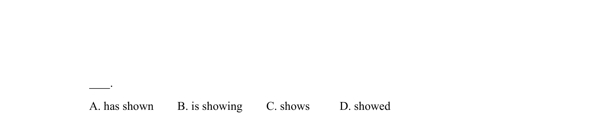
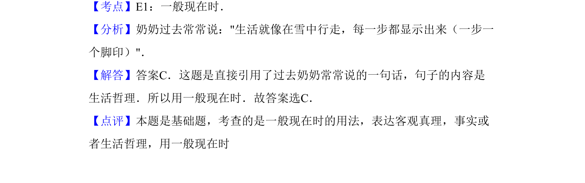

## 题面

## 摘要

单项选择，句子以'生活像在雪中行走'开头（截断），考查动词时态辨析（has shown/is showing/shows/showed）。

## 关联考点

- [[672-单项选择|单项选择]]
- [[913-语法|语法]]
- [[656-时态|时态]]

## 答案与解析

> 📄 原 PDF 第 8 页：`素材/真题/吉林/2008-2024·（吉林）英语高考真题/2012年高考英语试卷（新课标）（解析卷）.pdf`
