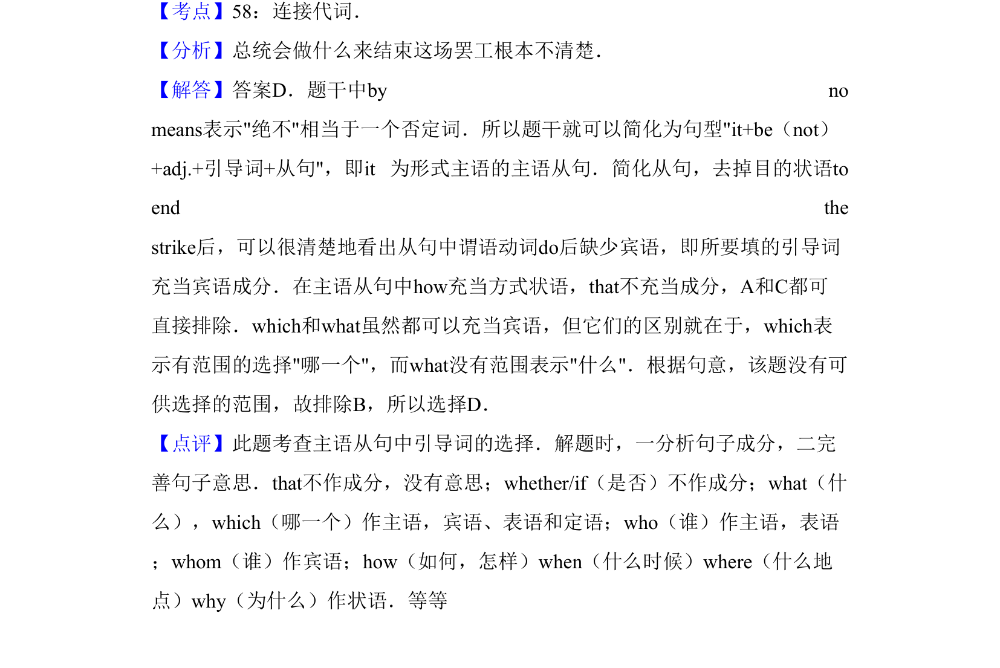

## 题面

## 摘要

该题考查主语从句中连接代词 what 的选用，需分析从句缺少宾语且无语义范围。

## 关联考点

- [[921-连接代词|连接代词]]
- [[354-主语从句|主语从句]]
- [[786-句子成分分析|句子成分分析]]

## 答案与解析

> 📄 原 PDF 第 9 页：`素材/真题/吉林/2008-2024·（吉林）英语高考真题/2012年高考英语试卷（新课标）（解析卷）.pdf`
