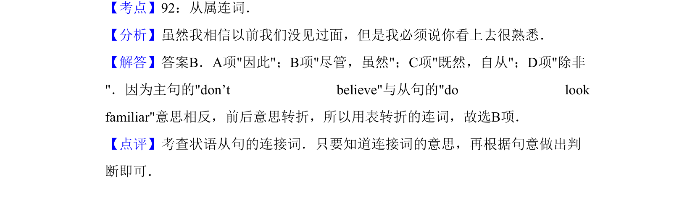

## 题面

## 摘要

考查转折连词的使用，表达“虽然以前没见过，但看起来很面熟”的语义关系。

## 关联考点

- [[944-concession|concession]]
- [[617-状语从句|adverbial clause]]
- [[625-although|although]]
- [[701-but|but]]

## 答案与解析

> 📄 原 PDF 第 9 页：`素材/真题/吉林/2008-2024·（吉林）英语高考真题/2012年高考英语试卷（新课标）（解析卷）.pdf`
