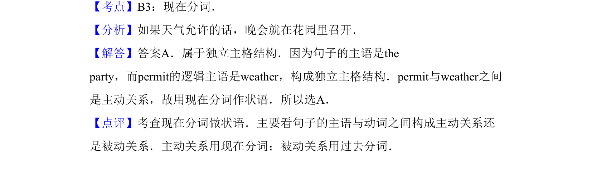

## 题面

## 摘要

该题考查独立主格结构中现在分词作状语，需判断逻辑主语与动词的主动关系。

## 关联考点

- [[523-独立主格-入门|独立主格]]
- [[866-现在分词|现在分词]]
- [[864-状语|状语]]

## 答案与解析

> 📄 原 PDF 第 11 页：`素材/真题/吉林/2008-2024·（吉林）英语高考真题/2012年高考英语试卷（新课标）（解析卷）.pdf`
