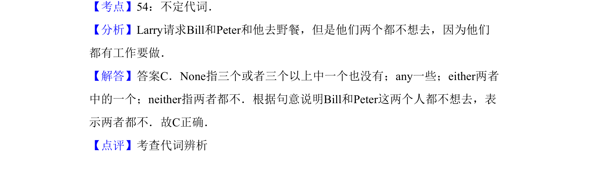

## 题面

## 摘要

单项选择，考查代词辨析（either/any/neither/none），句意为'Larry邀请Bill和Peter野餐但两人都不想去'。

## 关联考点

- [[672-单项选择|单项选择]]
- [[912-语法|语法]]
- [[454-代词|代词]]

## 答案与解析

> 📄 原 PDF 第 12 页：`素材/真题/吉林/2008-2024·（吉林）英语高考真题/2012年高考英语试卷（新课标）（解析卷）.pdf`
