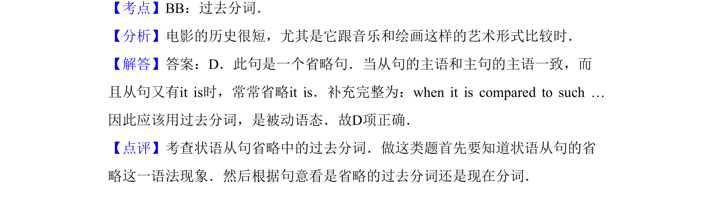

## 题面

## 摘要

单项选择，考查分词短语作状语（having compared to/comparing to/compare to/compared to），讨论电影与音乐绘画的历史长短对比。

## 关联考点

- [[672-单项选择|单项选择]]
- [[913-语法|语法]]
- [[931-非谓语动词|非谓语动词]]

## 答案与解析

> 📄 原 PDF 第 12 页：`素材/真题/吉林/2008-2024·（吉林）英语高考真题/2012年高考英语试卷（新课标）（解析卷）.pdf`
