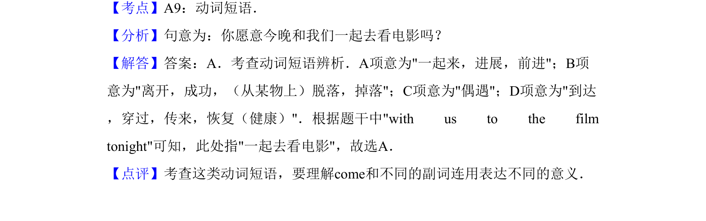

## 题面

## 摘要

本题考察动词短语come along、come off、come across、come through的含义及用法辨析。

## 关联考点

- [[779-动词短语|动词短语]]
- [[661-短语辨析|短语辨析]]

## 答案与解析

> 📄 原 PDF 第 8 页：`素材/真题/吉林/2008-2024·（吉林）英语高考真题/2013年高考英语试卷（新课标Ⅱ卷）（解析卷）.pdf`
