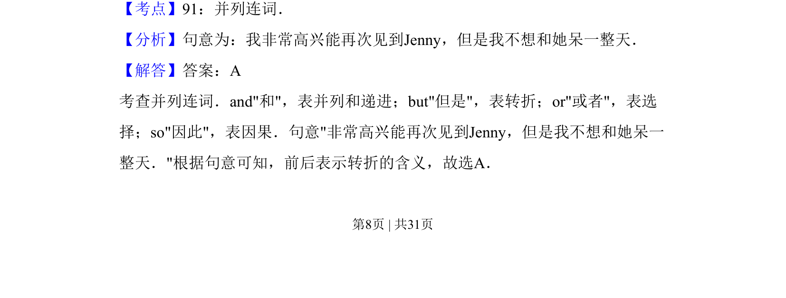

## 题面

## 摘要

本题考查并列连词的用法，根据句意选择正确的转折连词。

## 关联考点

- [[815-并列连词|并列连词]]
- [[670-转折关系|转折关系]]
- [[910-语境选择|语境选择]]

## 答案与解析

> 📄 原 PDF 第 8 页：`素材/真题/吉林/2008-2024·（吉林）英语高考真题/2013年高考英语试卷（新课标Ⅱ卷）（解析卷）.pdf`
