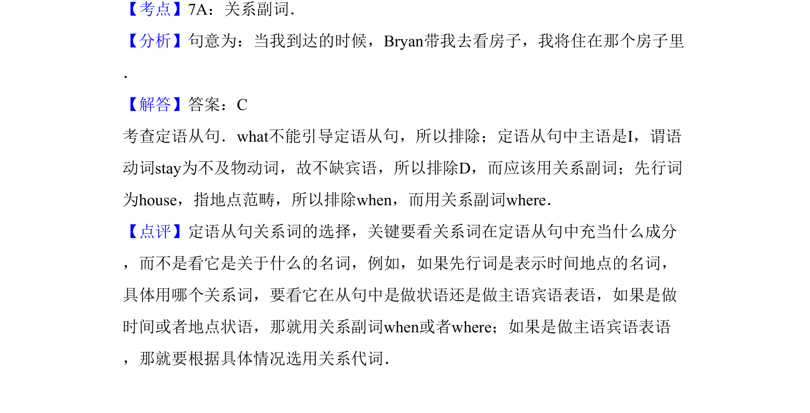

## 题面

## 摘要

本题为英语语法题，非数学题。考查定语从句连接词选择，根据从句成分判断关系副词 where 用法。

## 关联考点

- [[314-定语从句-初中入门|定语从句]]
- [[398-关系副词-where-when-why|关系副词]]
- [[句子成分]]

## 答案与解析

> 📄 原 PDF 第 9 页：`素材/真题/吉林/2008-2024·（吉林）英语高考真题/2013年高考英语试卷（新课标Ⅱ卷）（解析卷）.pdf`
