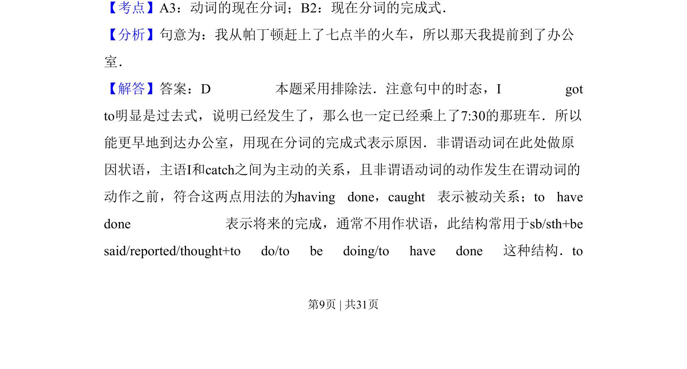
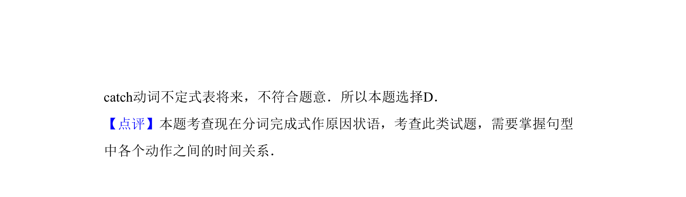

## 题面

## 摘要

考查现在分词完成式作原因状语的用法，区分过去分词与不定式完成式。

## 关联考点

- [[868-现在分词完成式|现在分词完成式]]
- [[671-非谓语动词作状语|非谓语动词作状语]]
- [[867-现在分词主动与被动|现在分词主动与被动]]

## 答案与解析

> 📄 原 PDF 第 9 页：`素材/真题/吉林/2008-2024·（吉林）英语高考真题/2013年高考英语试卷（新课标Ⅱ卷）（解析卷）.pdf`
