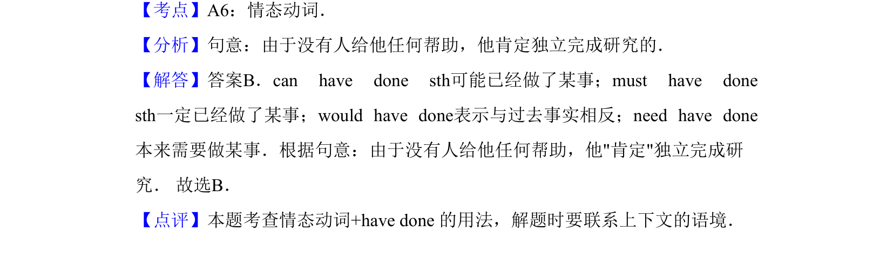

## 题面

## 摘要

本题考查情态动词must have done表示对过去肯定推测的用法。

## 关联考点

- [[039-情态动词can|情态动词]]
- [[272-现在完成时入门|现在完成时]]
- [[语境推测]]

## 答案与解析

> 📄 原 PDF 第 10 页：`素材/真题/吉林/2008-2024·（吉林）英语高考真题/2013年高考英语试卷（新课标Ⅱ卷）（解析卷）.pdf`
