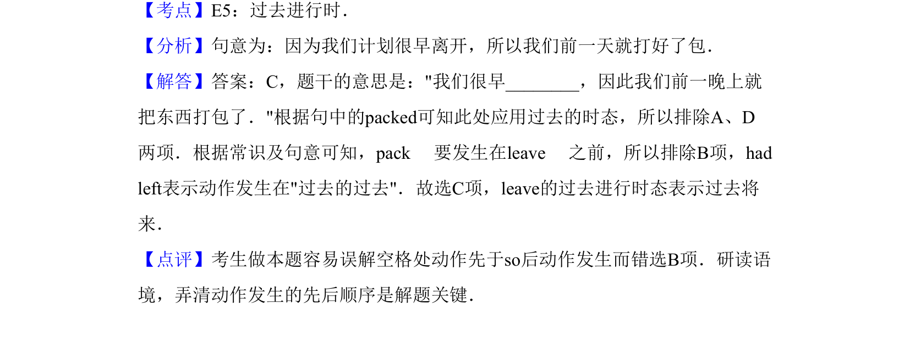

## 题面

## 摘要

本题通过“打包”发生在“离开”之前的语境，考查过去进行时表过去将来的用法。

## 关联考点

- [[226-What were you doing when...？|过去进行时]]
- [[时态]]
- [[语境理解]]
- [[动作先后顺序]]

## 答案与解析

> 📄 原 PDF 第 10 页：`素材/真题/吉林/2008-2024·（吉林）英语高考真题/2013年高考英语试卷（新课标Ⅱ卷）（解析卷）.pdf`
