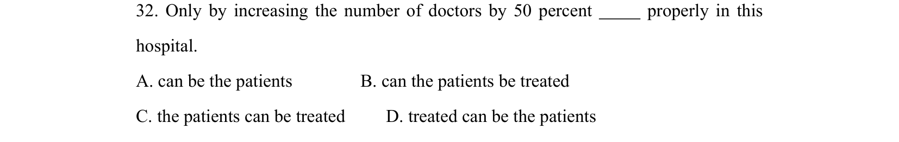
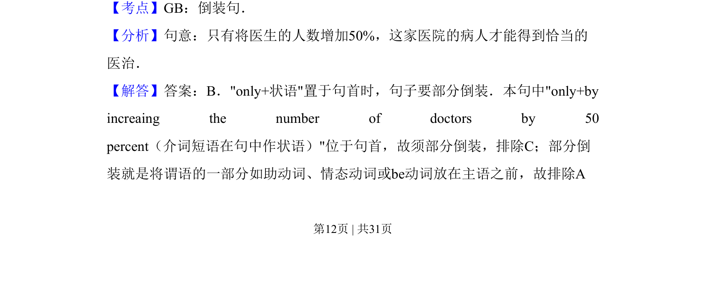
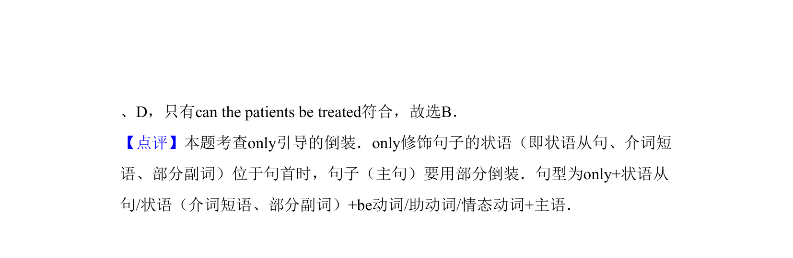

## 题面

## 摘要

单项选择，考查倒装句结构（only by…），辨析四个选项的语序，句意关于增加医生数量才能合理治疗病人。

## 关联考点

- [[单项选择]]
- [[语法]]
- [[328-文言倒装句|倒装句]]

## 答案与解析

> 📄 原 PDF 第 12 页：`素材/真题/吉林/2008-2024·（吉林）英语高考真题/2013年高考英语试卷（新课标Ⅱ卷）（解析卷）.pdf`
