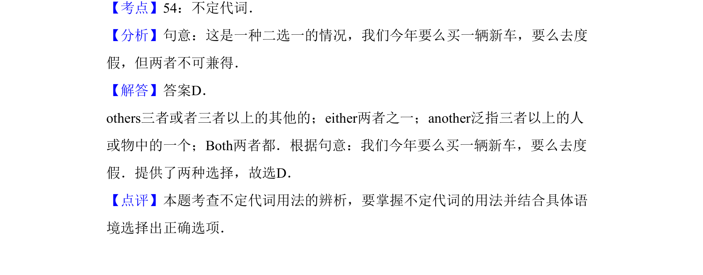

## 题面

## 摘要

单项选择，考查代词辨析（others/either/another/both），句意为'二选一情况，买车或度假但不能两者兼得'。

## 关联考点

- [[672-单项选择|单项选择]]
- [[912-语法|语法]]
- [[454-代词|代词]]

## 答案与解析

> 📄 原 PDF 第 13 页：`素材/真题/吉林/2008-2024·（吉林）英语高考真题/2013年高考英语试卷（新课标Ⅱ卷）（解析卷）.pdf`
