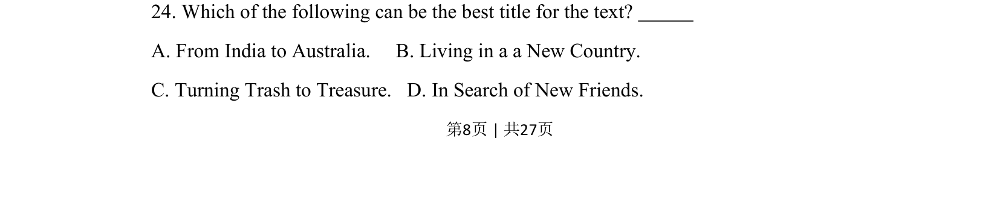
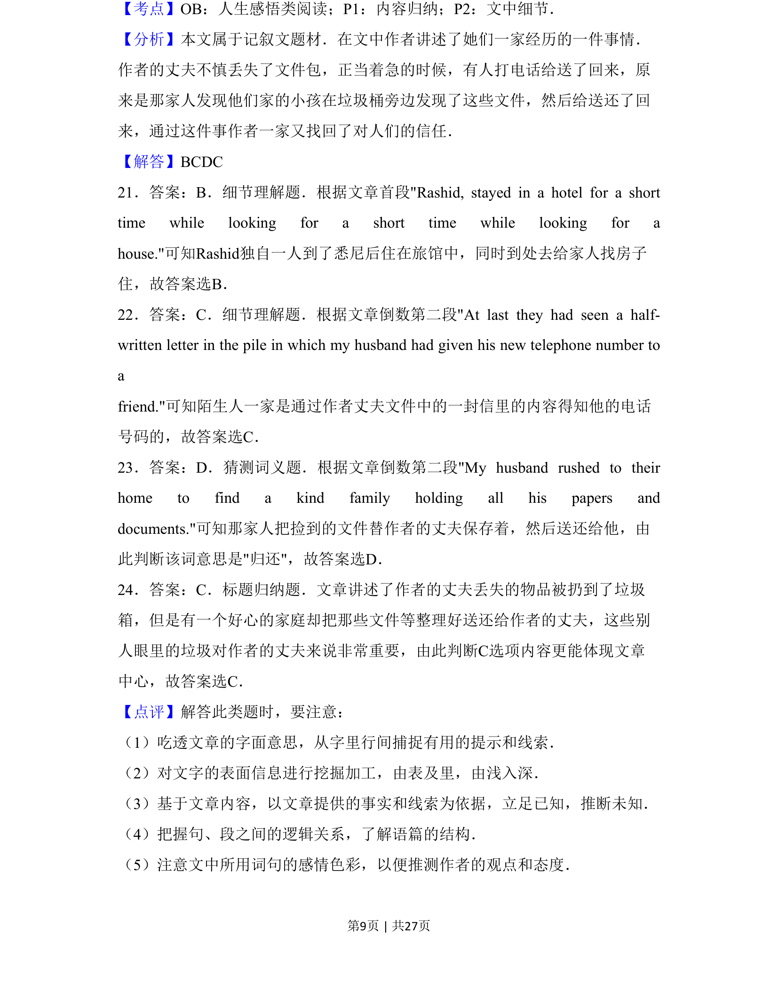
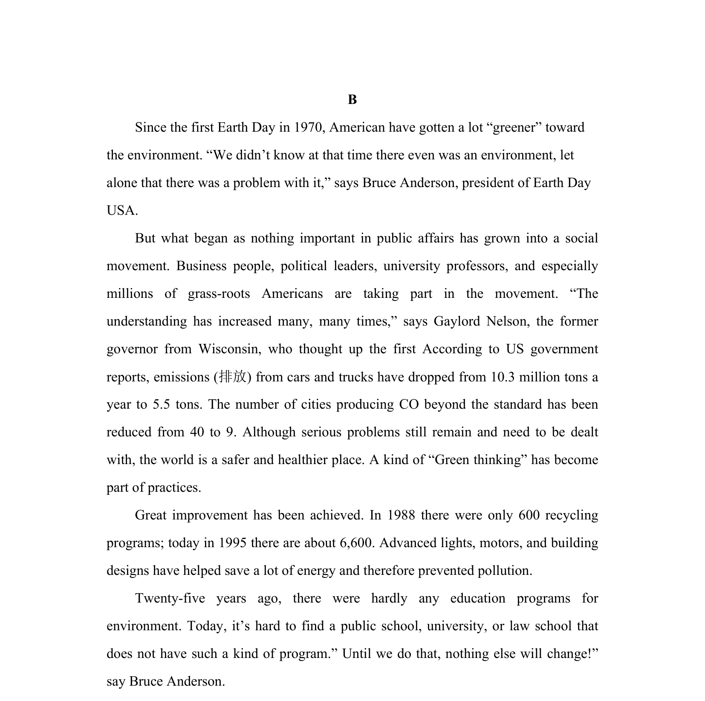

## 题面

## 摘要

考查对文章主旨的理解，要求选择最佳标题。

## 关联考点

- [[741-主旨大意|主旨大意]]
- [[857-标题归纳|标题归纳]]
- [[724-reading comprehension|阅读理解]]

## 答案与解析

> 📄 原 PDF 第 8 页：`素材/真题/吉林/2008-2024·（吉林）英语高考真题/2014年高考英语试卷（新课标Ⅱ卷）（解析卷）.pdf`
