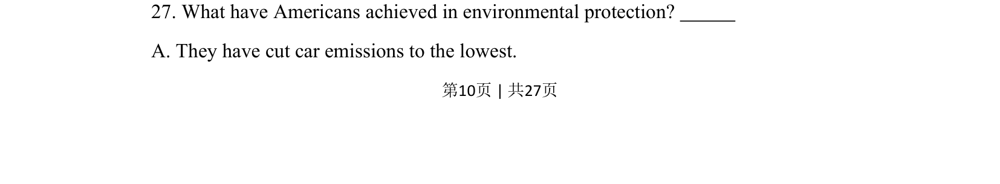
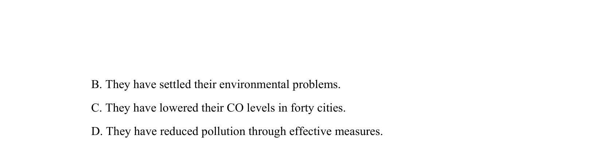

## 题面

## 摘要

考查从原文定位美国环保成就细节的能力，需识别 car emissions 与 lowest 的对应关系

## 关联考点

- [[690-Specific Information|细节理解]]
- [[865-环保主题词汇|环保主题词汇]]
- [[639-同义转述|同义转述]]

## 答案与解析

> 📄 原 PDF 第 10 页：`素材/真题/吉林/2008-2024·（吉林）英语高考真题/2014年高考英语试卷（新课标Ⅱ卷）（解析卷）.pdf`
