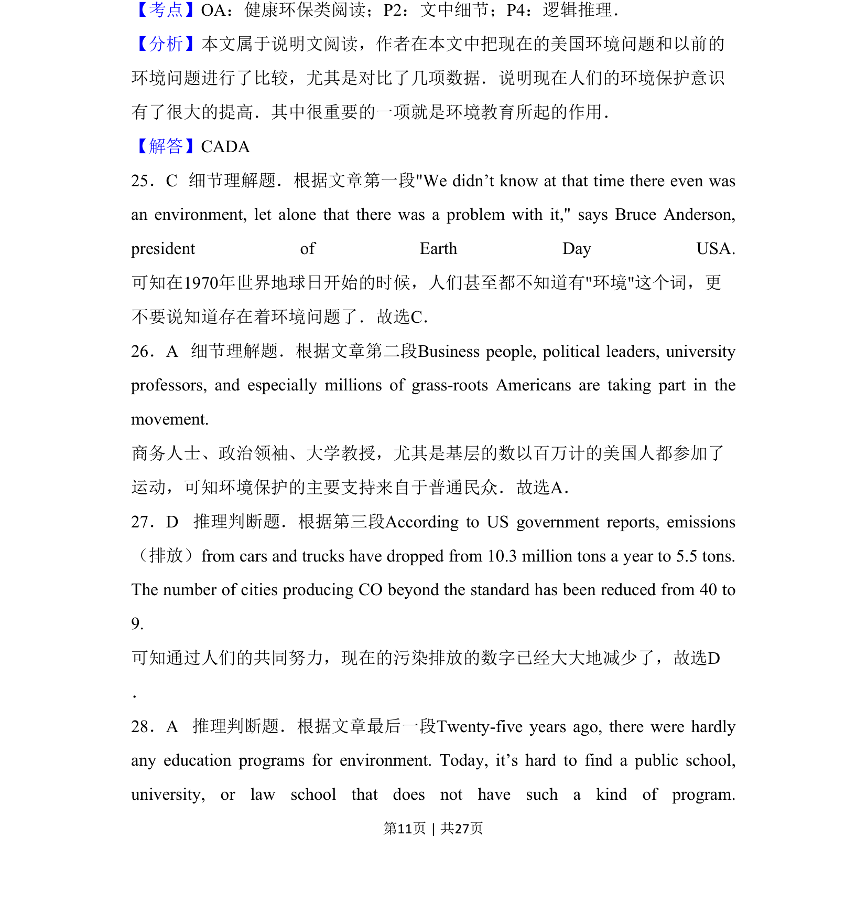
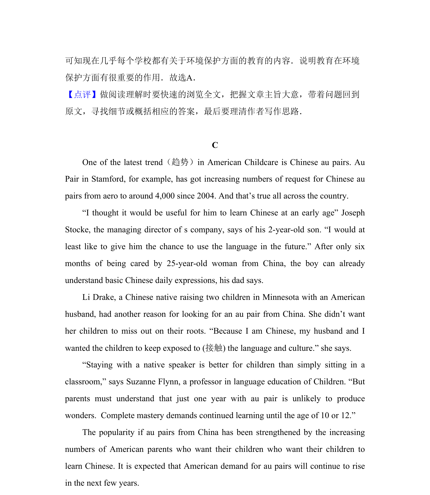

## 题面

## 摘要

阅读理解细节与推理判断，考查从文中提取信息和逻辑推断能力。

## 关联考点

- [[690-Specific Information|细节理解]]
- [[888-推理判断|推理判断]]

## 答案与解析

> 📄 原 PDF 第 11 页：`素材/真题/吉林/2008-2024·（吉林）英语高考真题/2014年高考英语试卷（新课标Ⅱ卷）（解析卷）.pdf`
