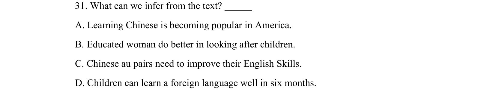
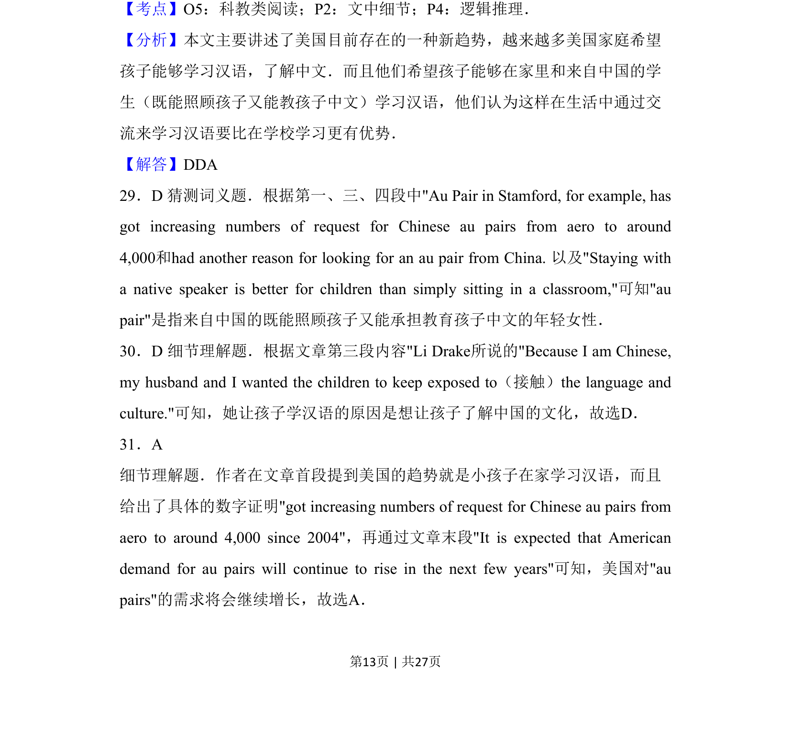
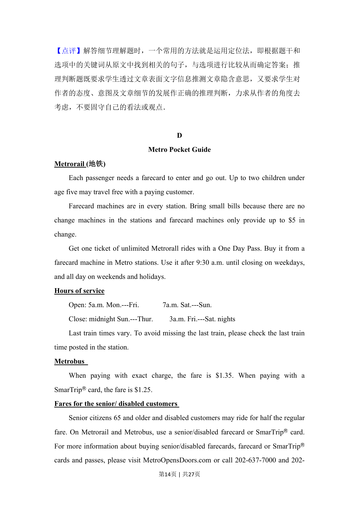
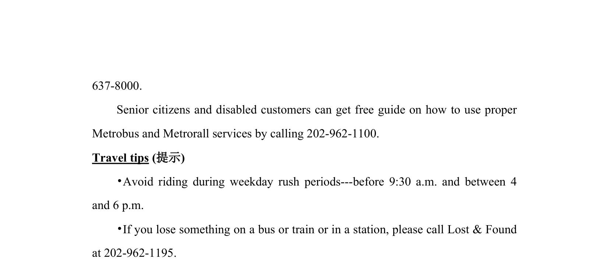

## 题面

## 摘要

本题考查利用导数求切线方程及讨论参数范围，涉及极限与不等式恒成立。

## 关联考点

- [[导数几何意义]]
- [[422-切线方程|切线方程]]
- [[参数范围]]
- [[极限]]

## 答案与解析

> 📄 原 PDF 第 13 页：`素材/真题/吉林/2008-2024·（吉林）英语高考真题/2014年高考英语试卷（新课标Ⅱ卷）（解析卷）.pdf`
