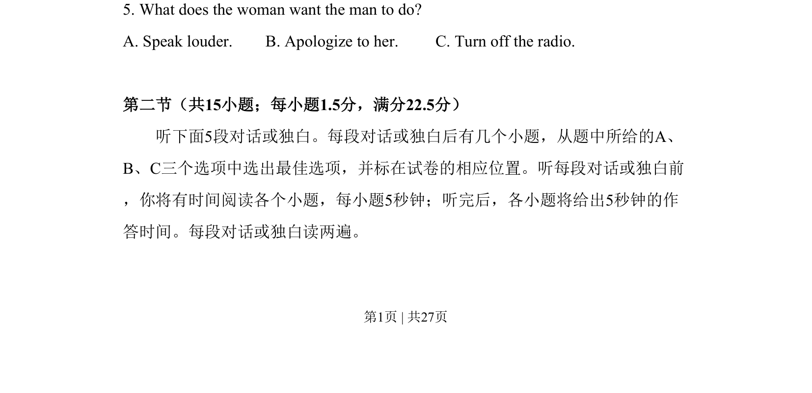

## 题面

## 摘要

听力简短对话理解，推断女士对男士的要求

## 关联考点

- [[644-听力说明|听力理解]]
- [[966-意图推断|意图推断]]
- [[690-Specific Information|细节理解]]

## 答案与解析

> 📄 原 PDF 第 1 页：`素材/真题/吉林/2008-2024·（吉林）英语高考真题/2015年高考英语试卷（新课标Ⅱ卷）（解析卷）.pdf`
