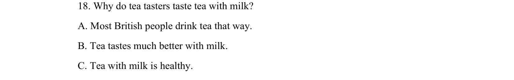

## 题面

## 摘要

该题考查对英国饮茶文化中茶品尝者加奶原因的细节理解。

## 关联考点

- [[689-Specific Information|细节理解]]
- [[887-推理判断|推理判断]]
- [[839-文化背景|文化背景]]

## 答案与解析

> 📄 原 PDF 第 3 页：`素材/真题/吉林/2008-2024·（吉林）英语高考真题/2015年高考英语试卷（新课标Ⅱ卷）（解析卷）.pdf`
