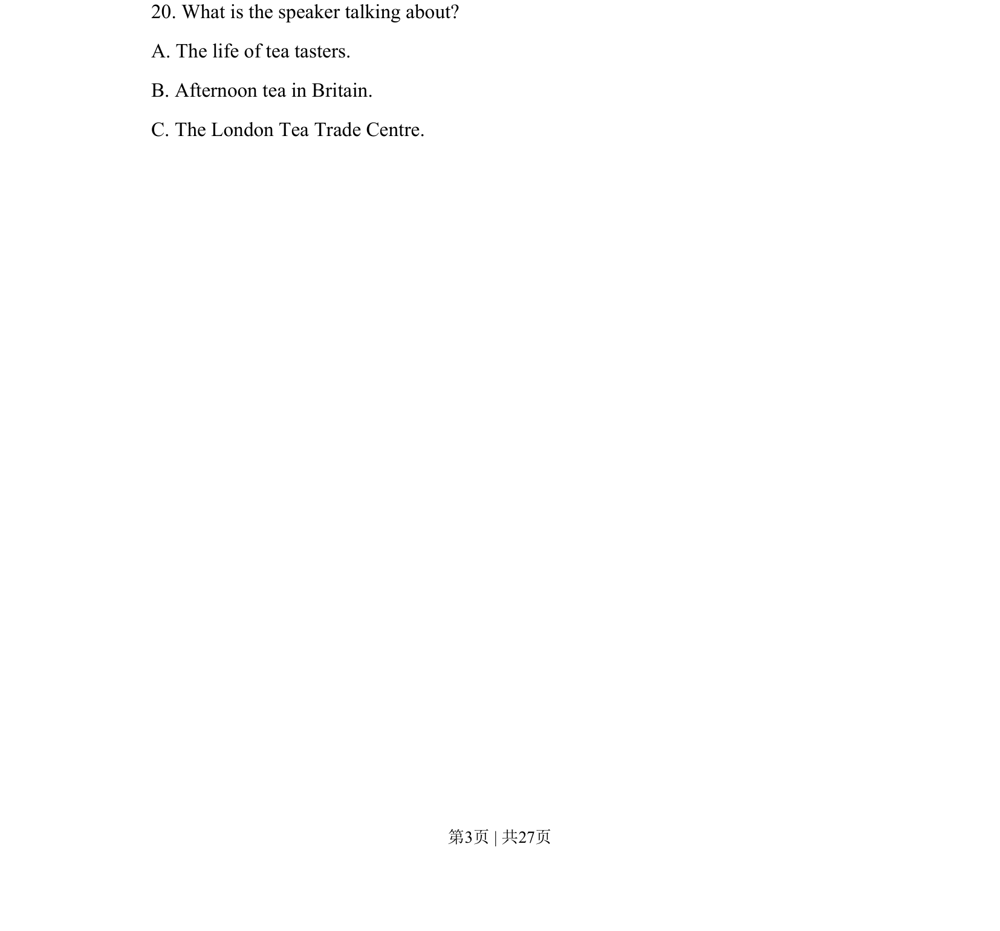
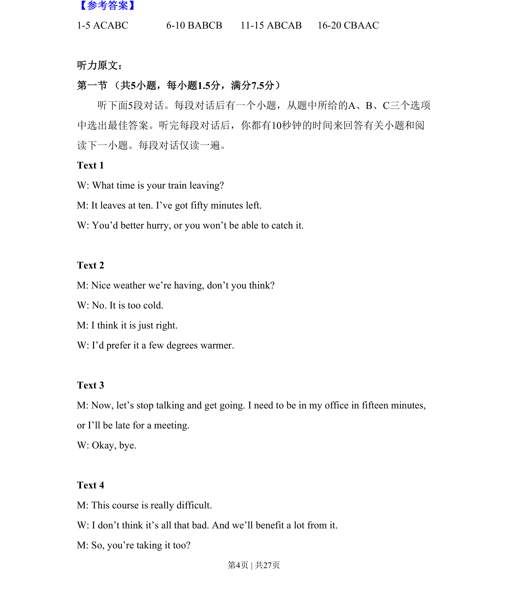
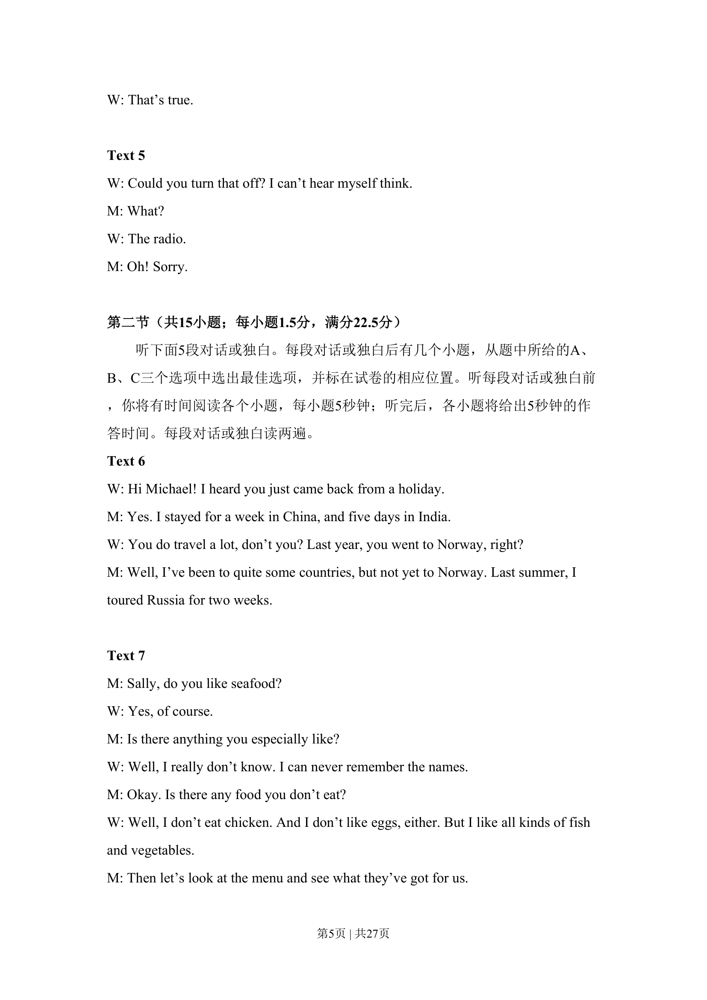
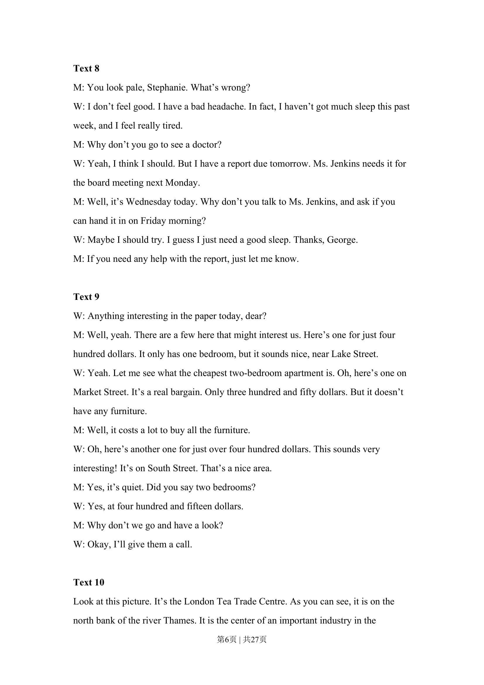
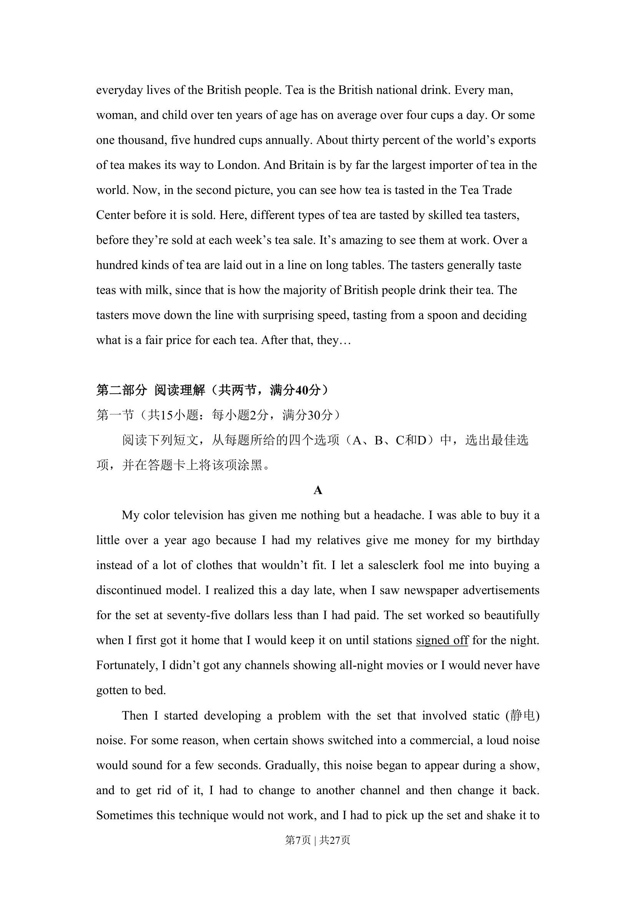
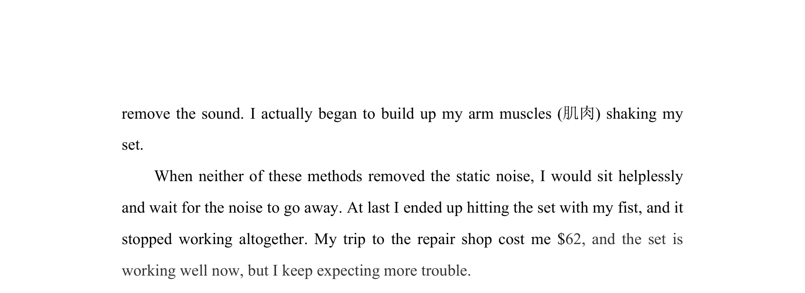

## 题面

## 摘要

考查听力主旨大意，需根据全文内容概括讲话主题。

## 关联考点

- [[680-Listening for main idea|Listening for main idea]]
- [[979-Gist comprehension|Gist comprehension]]

## 答案与解析

> 📄 原 PDF 第 3 页：`素材/真题/吉林/2008-2024·（吉林）英语高考真题/2015年高考英语试卷（新课标Ⅱ卷）（解析卷）.pdf`
