## 题面

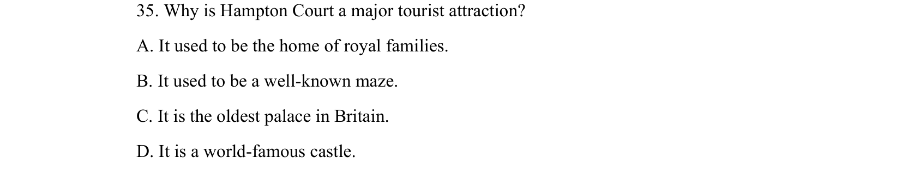

## 摘要

本题考查集合的交集运算，结合一元二次不等式与一元一次不等式的求解。

## 关联考点

- [[集合的交集]]
- [[267-一元二次不等式|一元二次不等式]]
- [[114-一元一次不等式|一元一次不等式]]

## 答案与解析

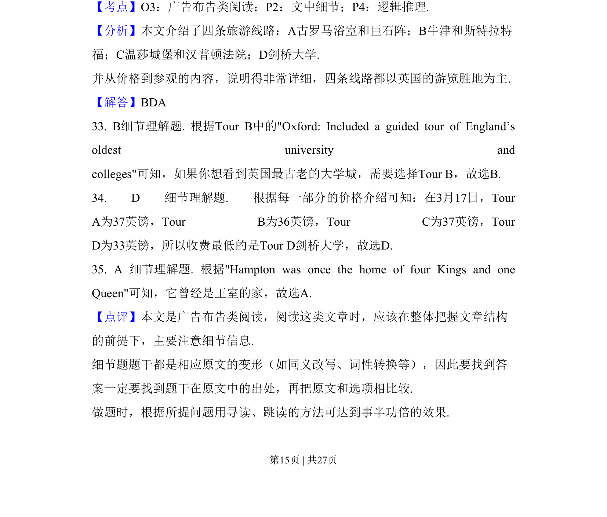
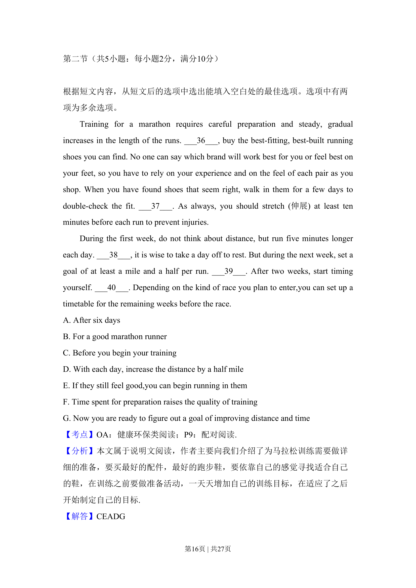
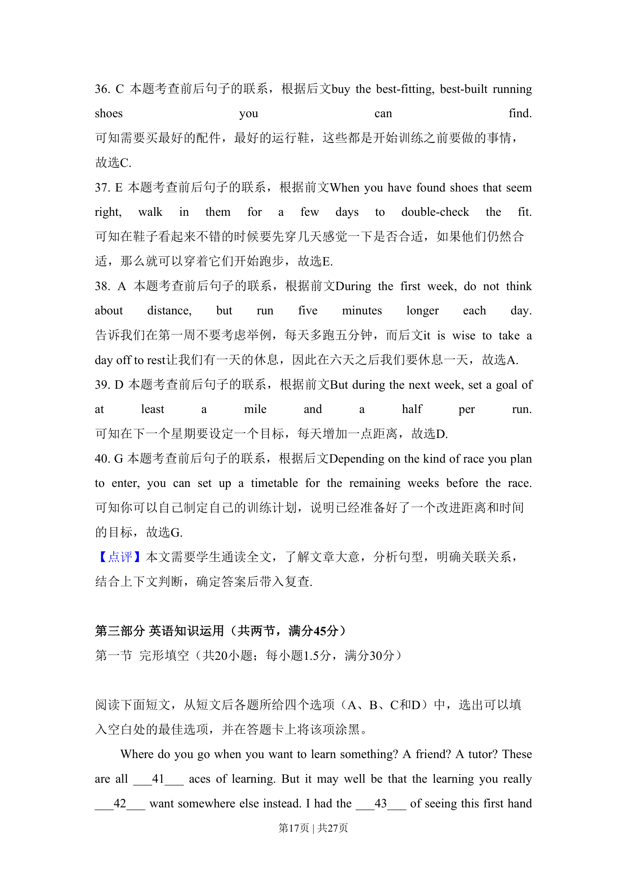
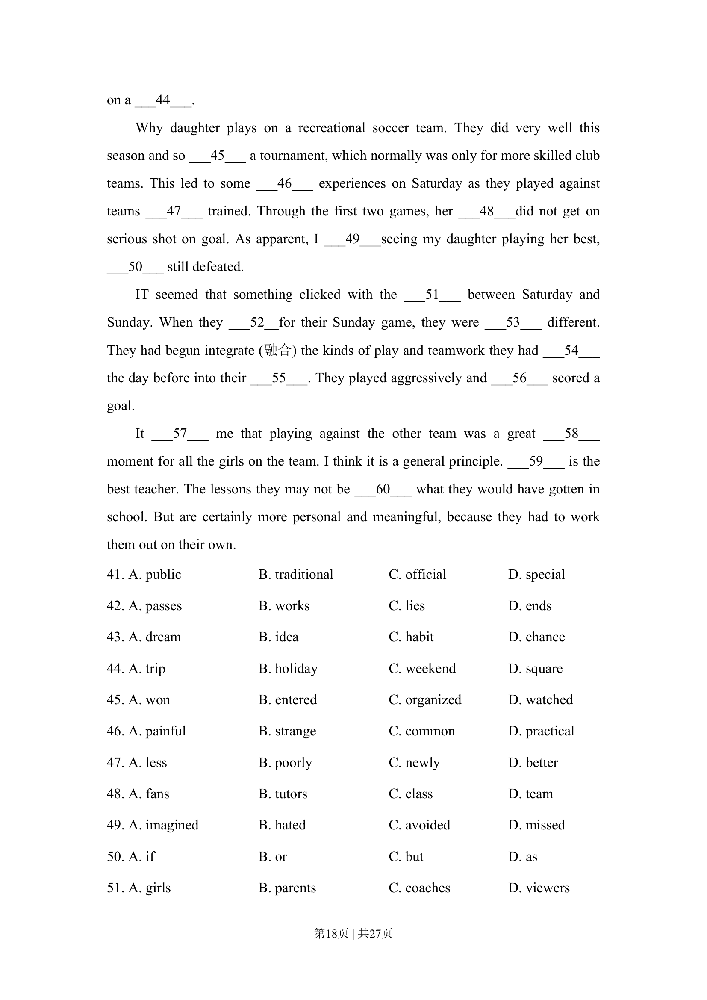
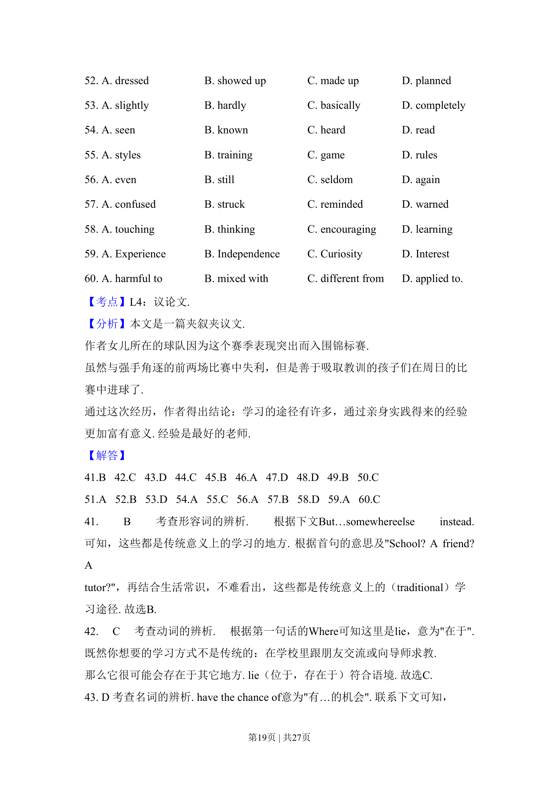
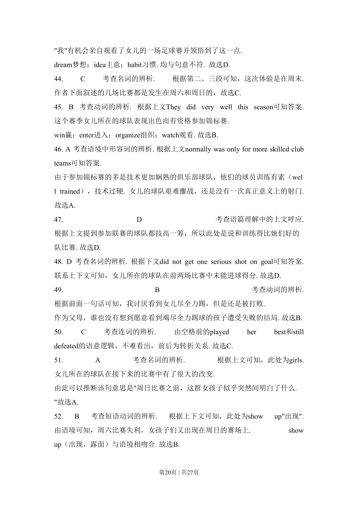
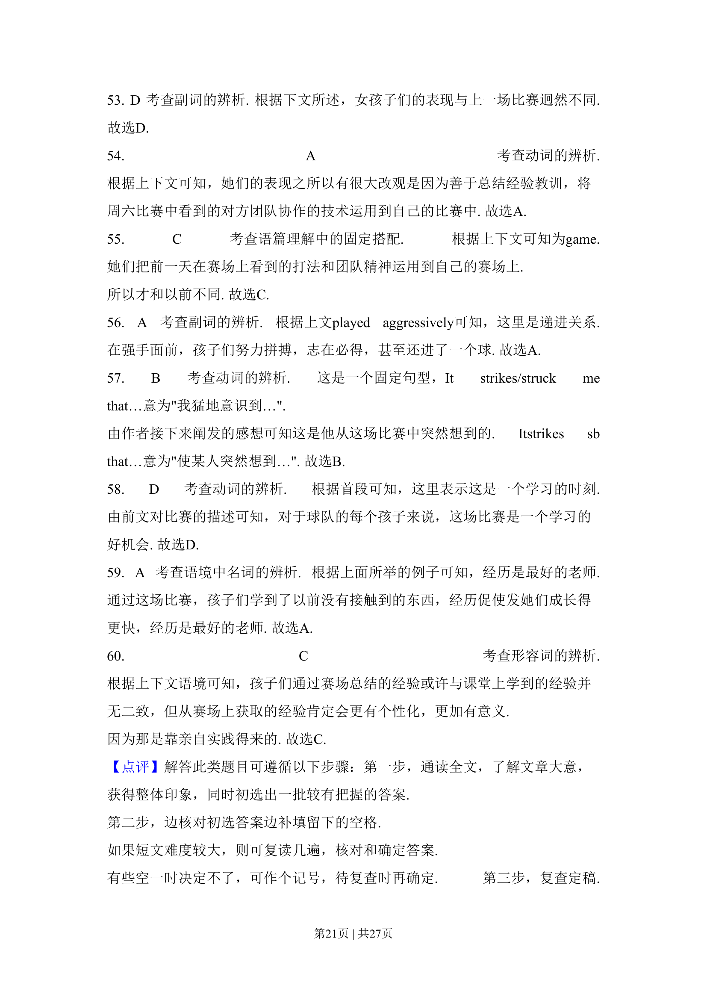
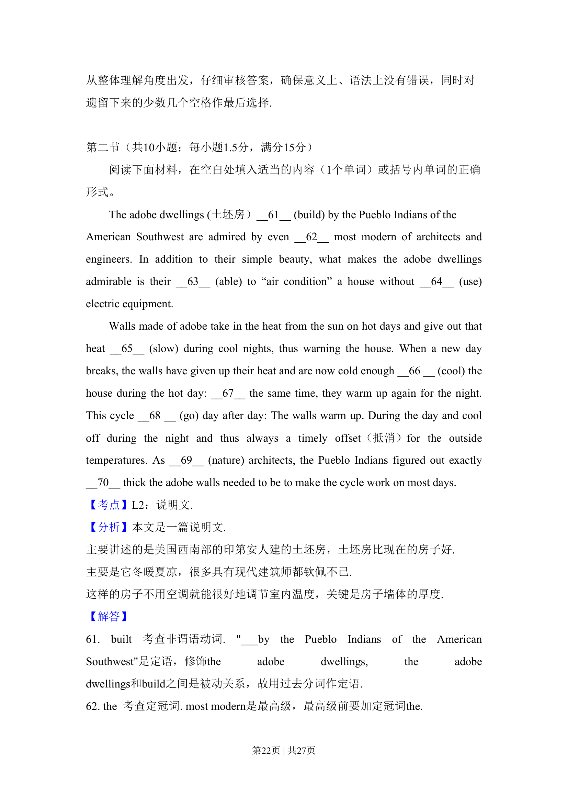
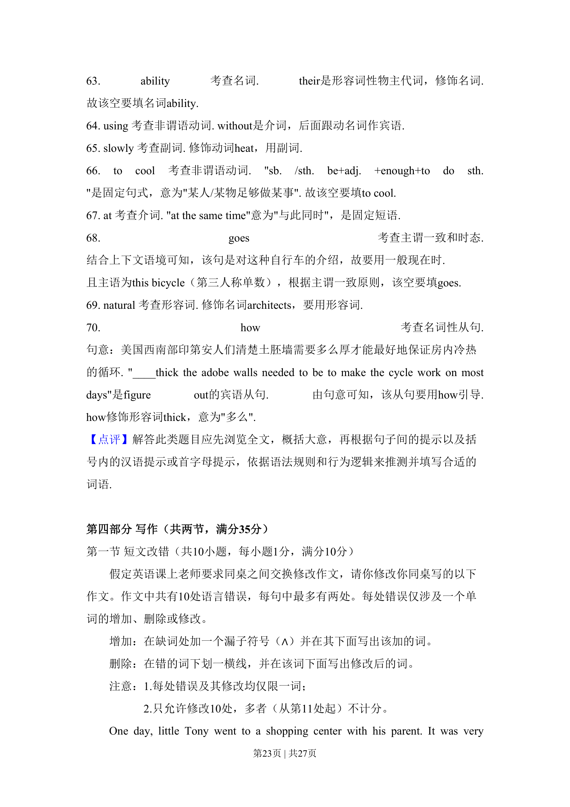
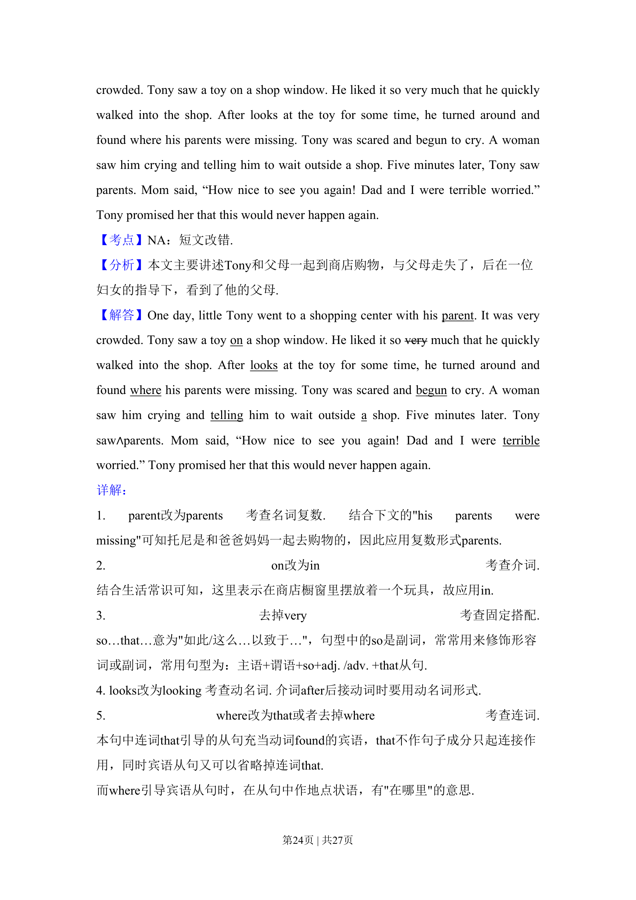
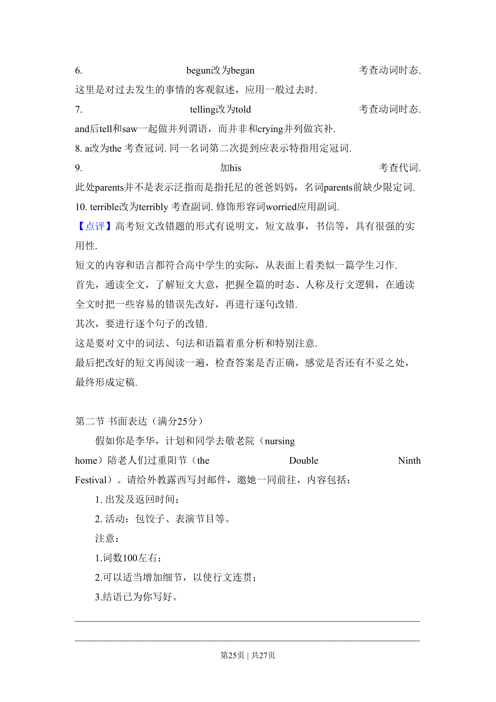
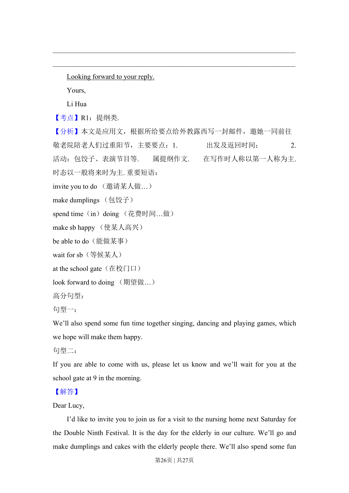
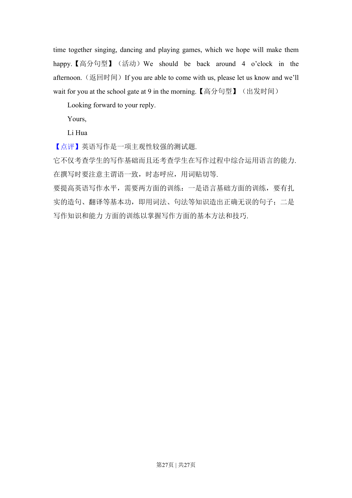

> 📄 原 PDF 第 15 页：`素材/真题/吉林/2008-2024·（吉林）英语高考真题/2015年高考英语试卷（新课标Ⅱ卷）（解析卷）.pdf`
