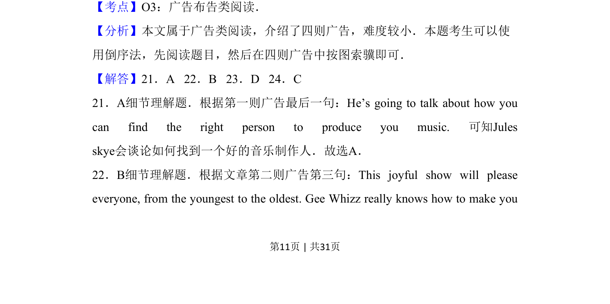
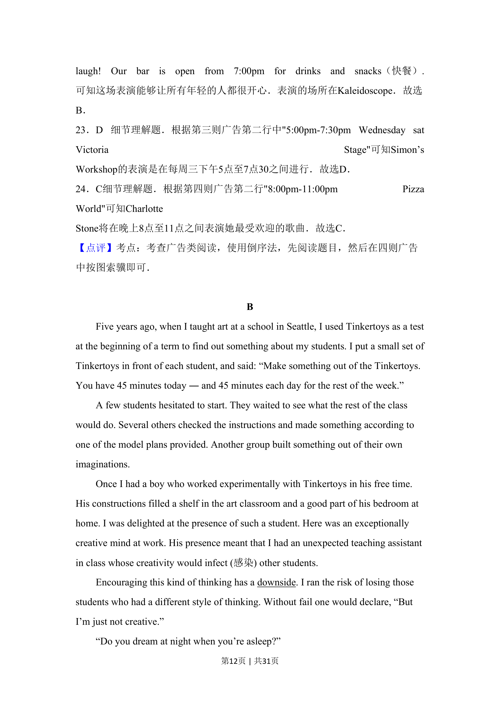
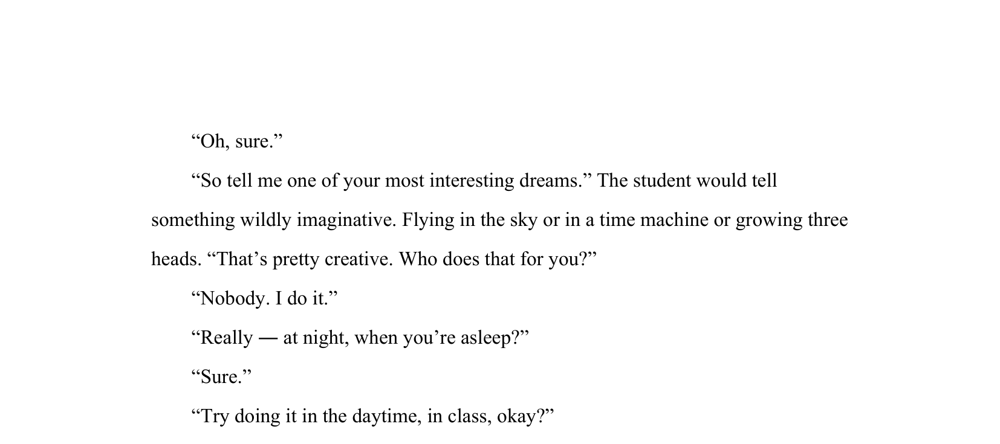

## 题面

## 摘要

本题要求根据广告信息找出歌手特定表演时间段。

## 关联考点

- [[689-Specific Information|细节理解]]
- [[768-信息筛选|信息筛选]]
- [[928-阅读能力|阅读能力]]

## 答案与解析

> 📄 原 PDF 第 11 页：`素材/真题/吉林/2008-2024·（吉林）英语高考真题/2016年高考英语试卷（新课标Ⅱ卷）（解析卷）.pdf`
