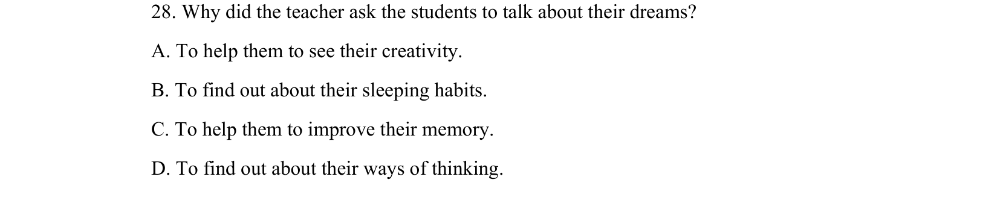
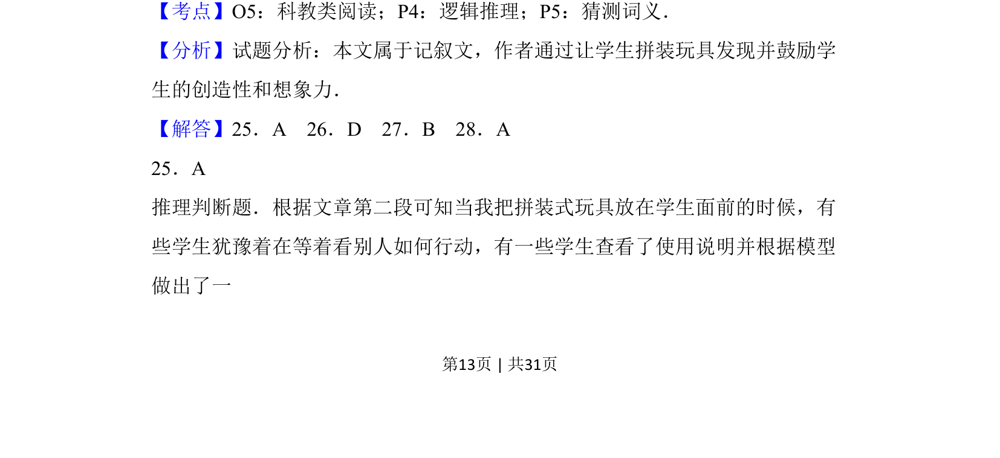
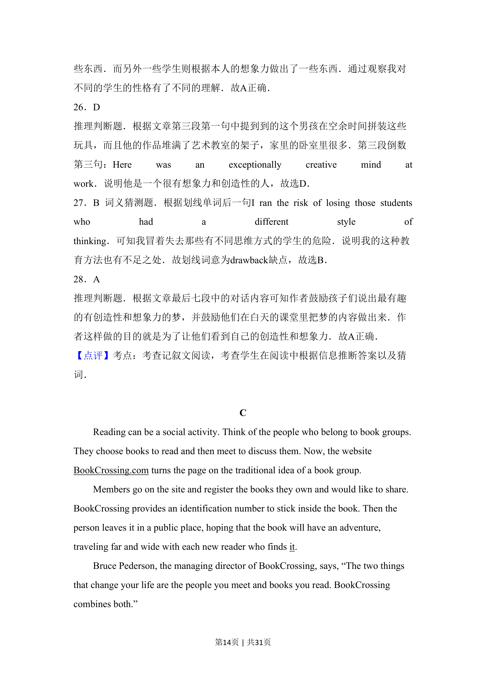
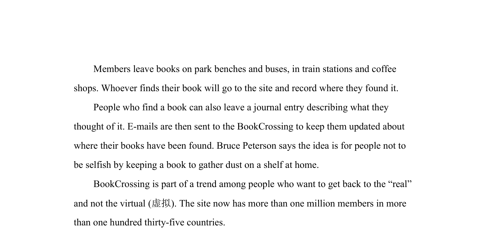

## 题面

## 摘要

教师通过玩具拼装活动了解学生思维方式与创造力。

## 关联考点

- [[872-科教类阅读|科教类阅读]]
- [[037-推理|逻辑推理]]
- [[660-猜测词义|猜测词义]]

## 答案与解析

> 📄 原 PDF 第 13 页：`素材/真题/吉林/2008-2024·（吉林）英语高考真题/2016年高考英语试卷（新课标Ⅱ卷）（解析卷）.pdf`
