## 题面

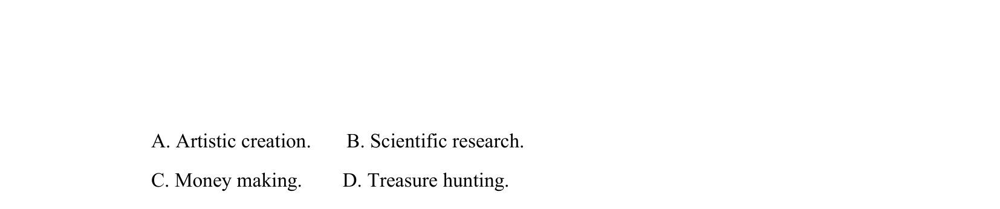

## 摘要

阅读理解推理题，关于1914年南极航行，考查Alexander认为此次航行的目的（艺术创作/科学研究/赚钱/寻宝）。

## 关联考点

- [[725-reading comprehension|阅读理解]]
- [[888-推理判断|推理判断]]
- [[146-记叙文要素|记叙文]]

## 答案与解析

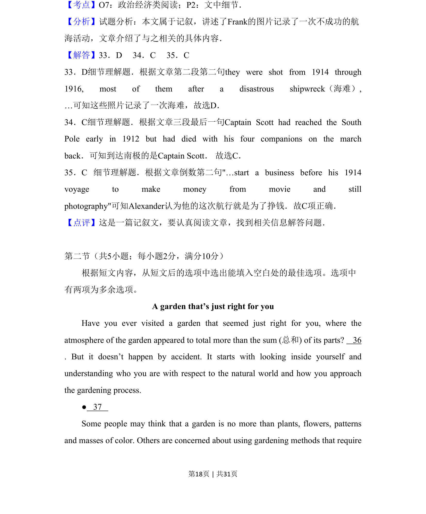
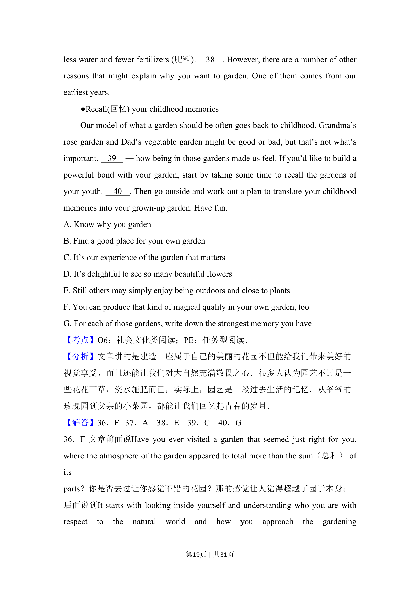
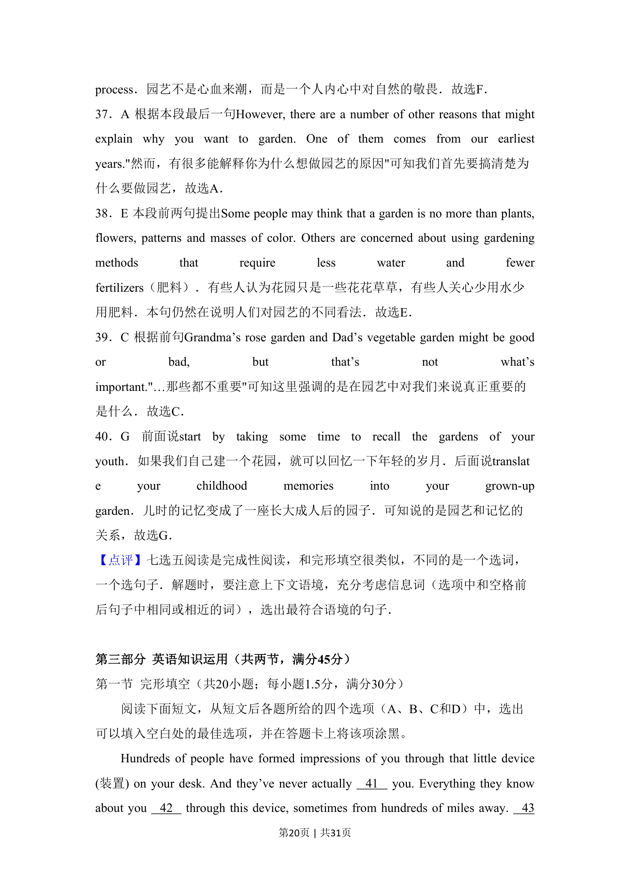
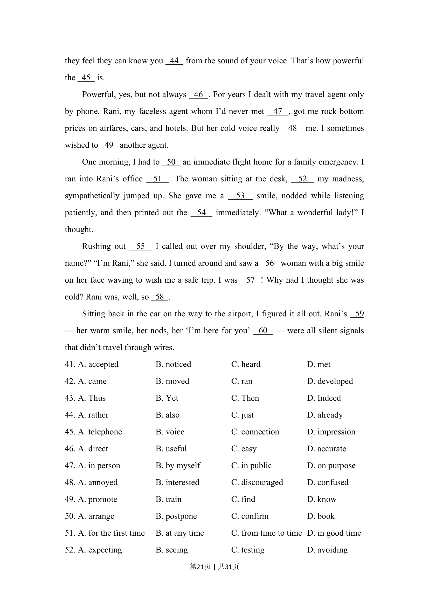
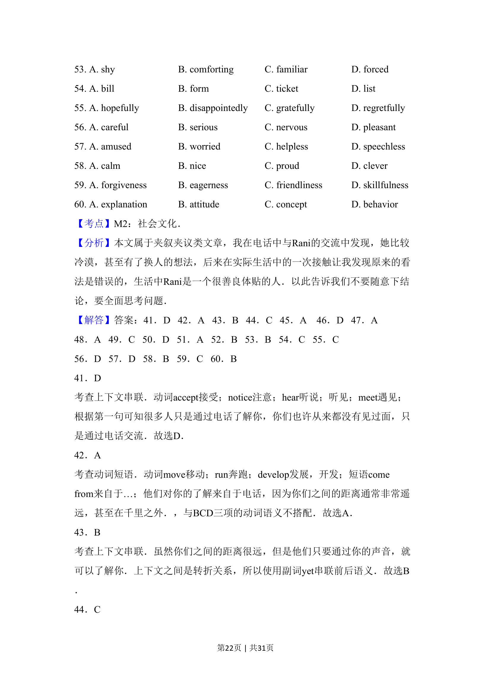
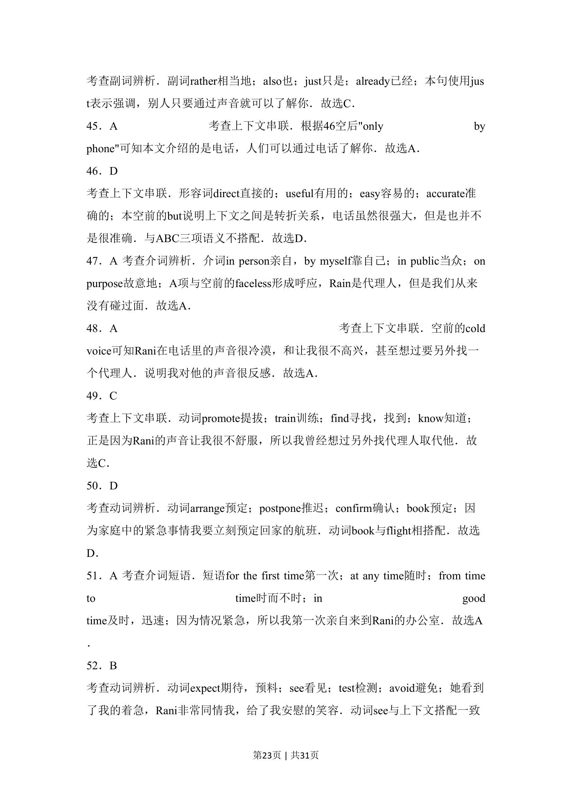
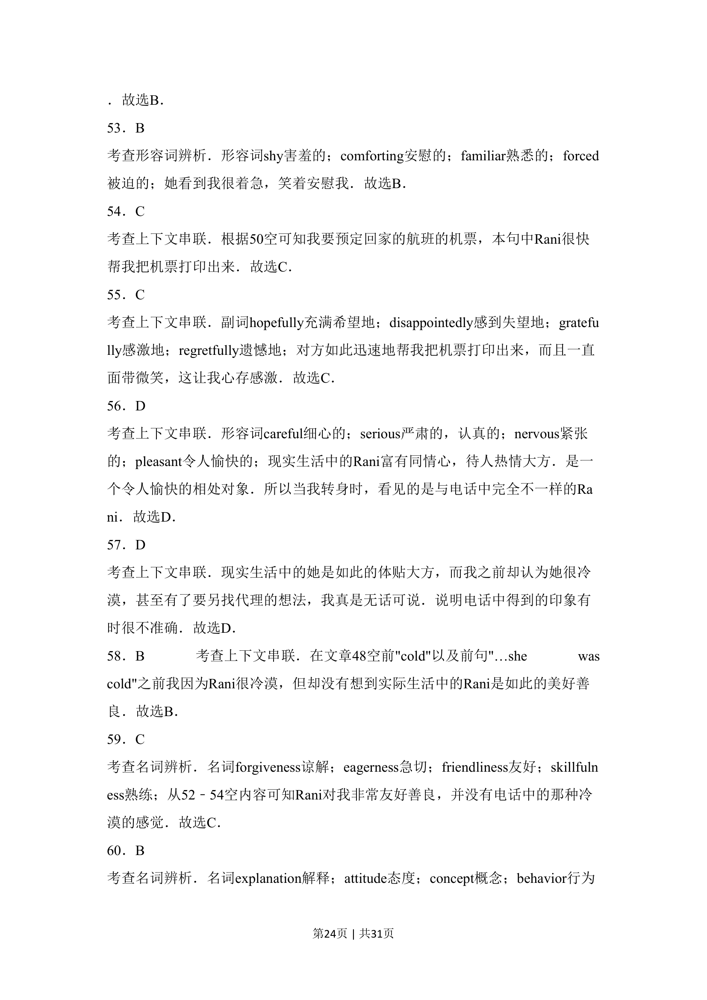
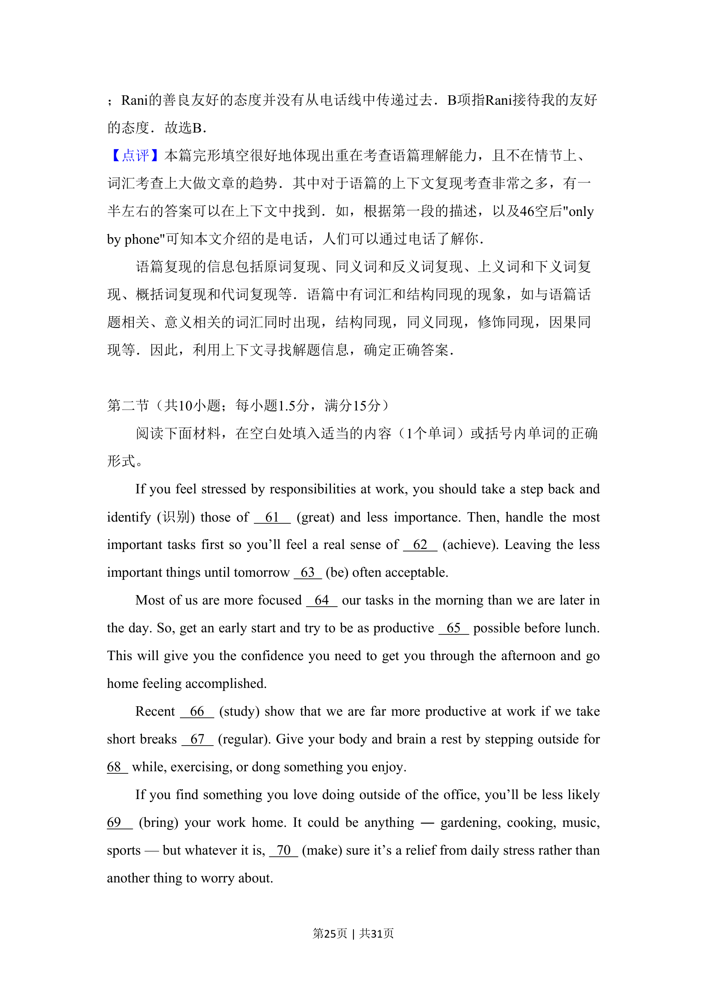
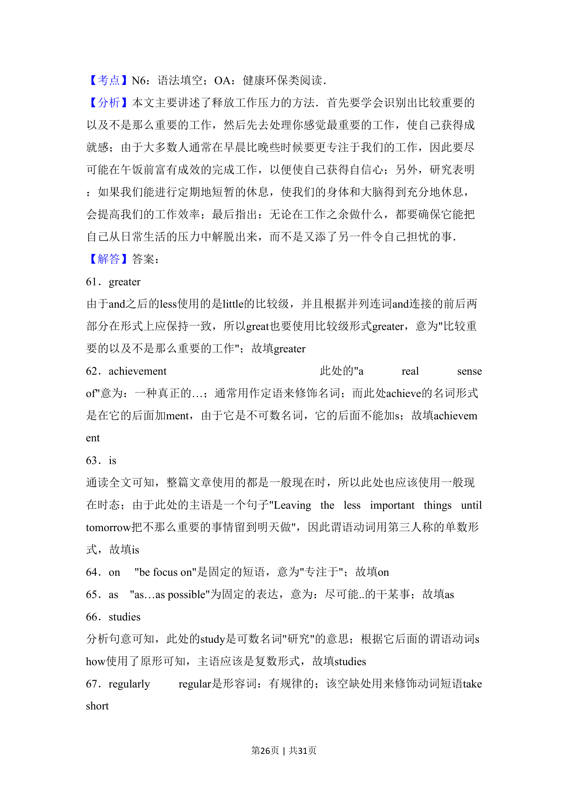
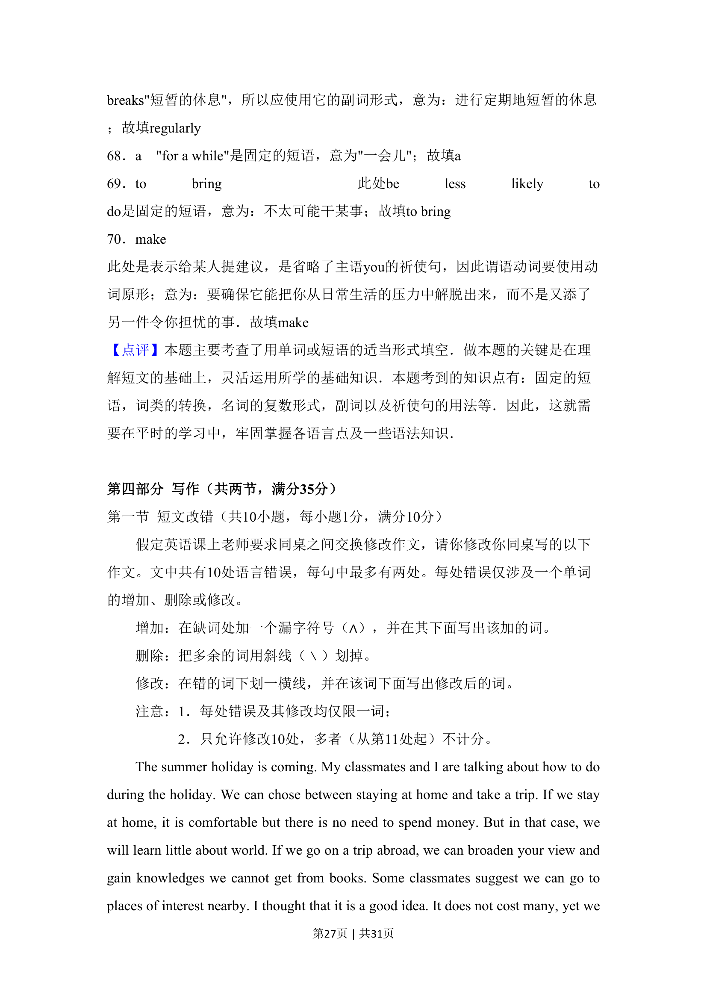
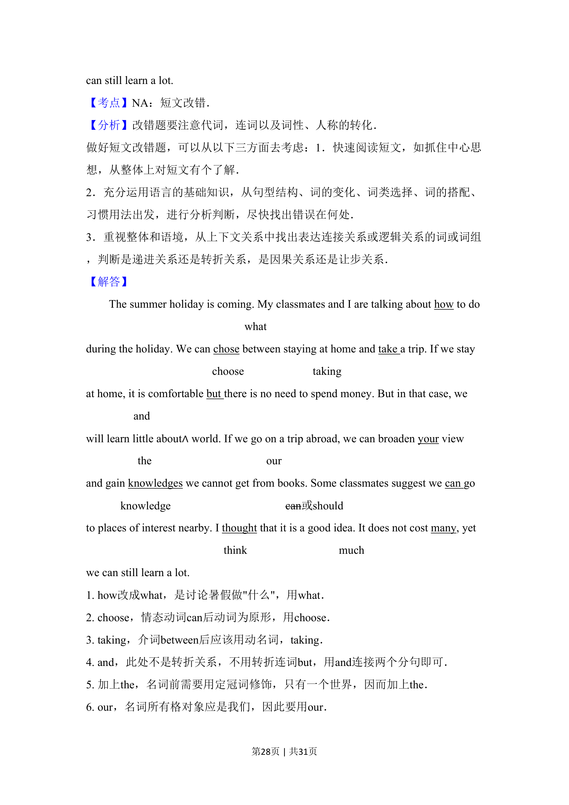
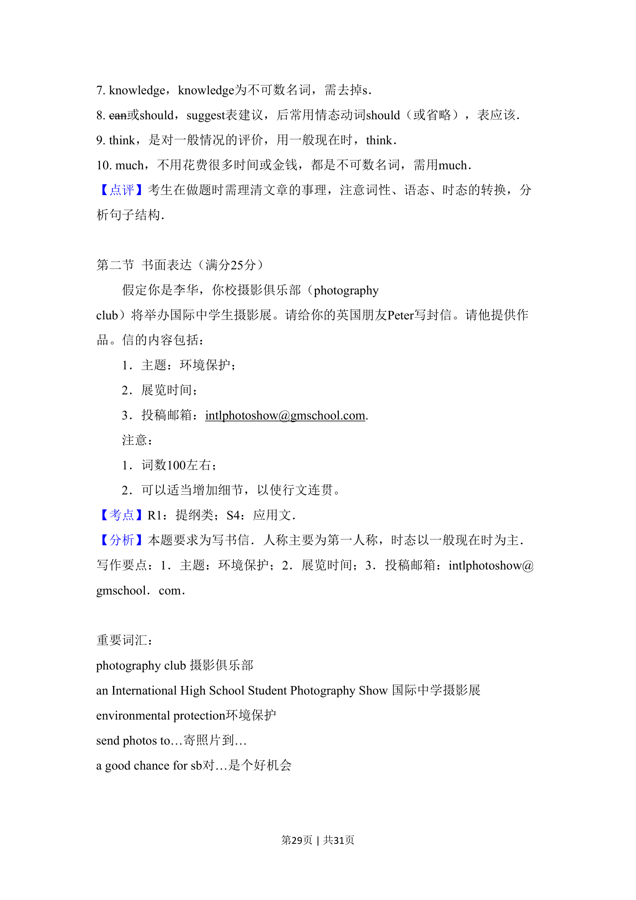
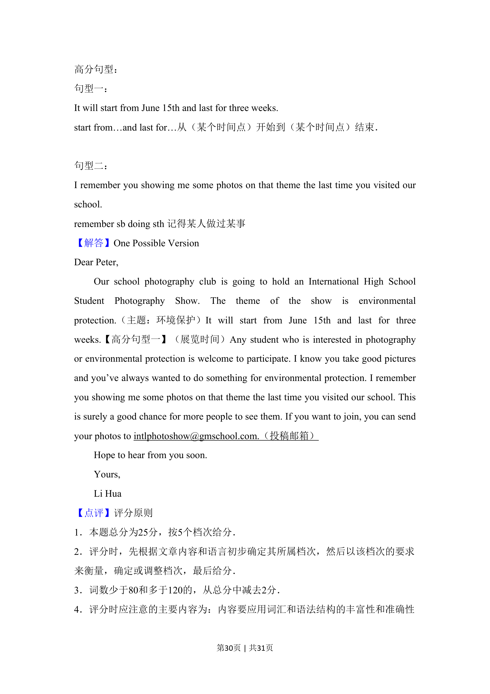
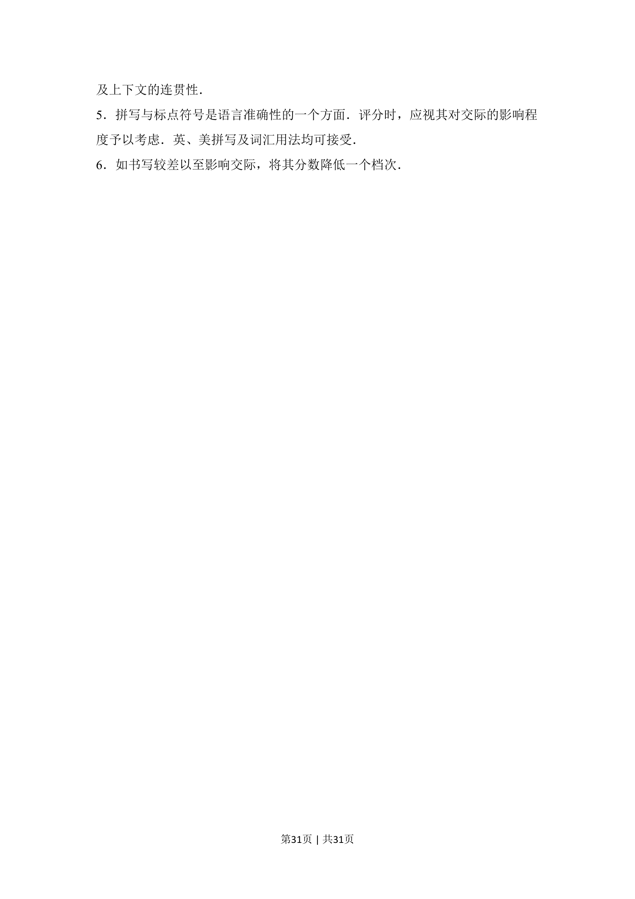

> 📄 原 PDF 第 17 页：`素材/真题/吉林/2008-2024·（吉林）英语高考真题/2016年高考英语试卷（新课标Ⅱ卷）（解析卷）.pdf`
