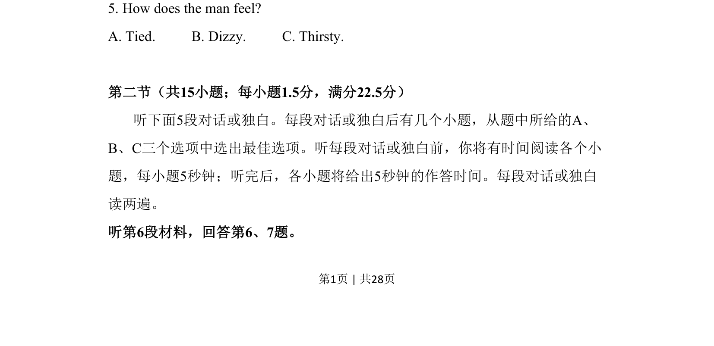

## 题面

## 摘要

听力题询问男士感受，考查理解说话者情绪状态细节的能力。

## 关联考点

- [[689-Specific Information|细节理解]]
- [[820-情感态度|情感态度]]
- [[794-听力|听力]]

## 答案与解析

> 📄 原 PDF 第 1 页：`素材/真题/吉林/2008-2024·（吉林）英语高考真题/2017年高考英语试卷（新课标Ⅱ卷）（解析卷）.pdf`
