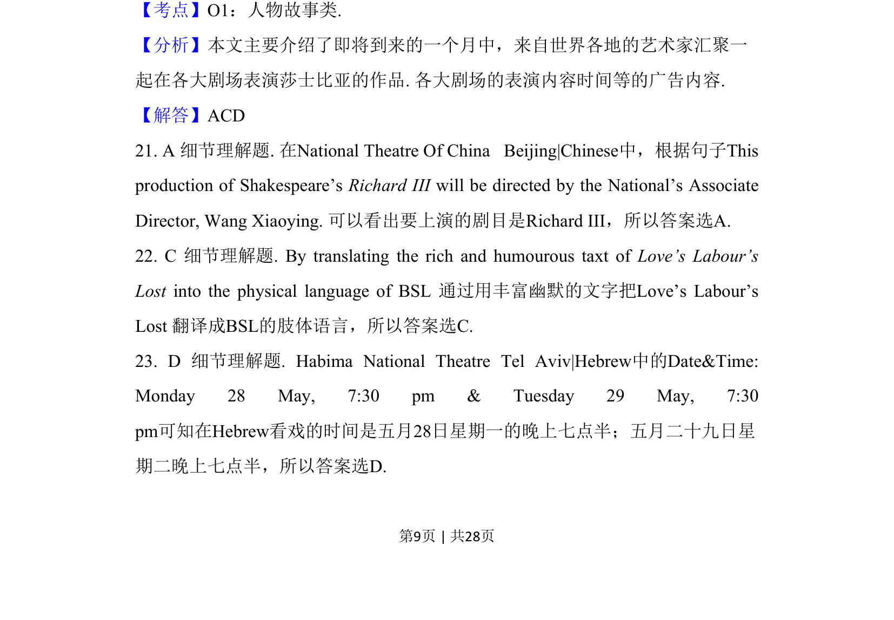
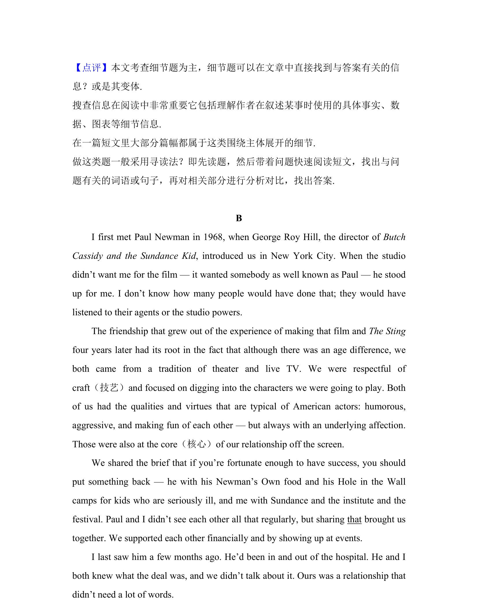

## 题面

## 摘要

该题考查从戏剧演出广告中定位希伯来语戏剧的具体上演时间。

## 关联考点

- [[690-Specific Information|细节理解]]
- [[690-Specific Information|Specific Information]]

## 答案与解析

> 📄 原 PDF 第 9 页：`素材/真题/吉林/2008-2024·（吉林）英语高考真题/2017年高考英语试卷（新课标Ⅱ卷）（解析卷）.pdf`
