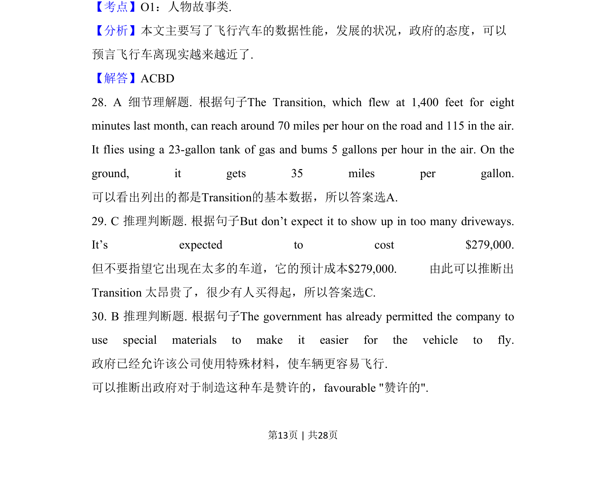
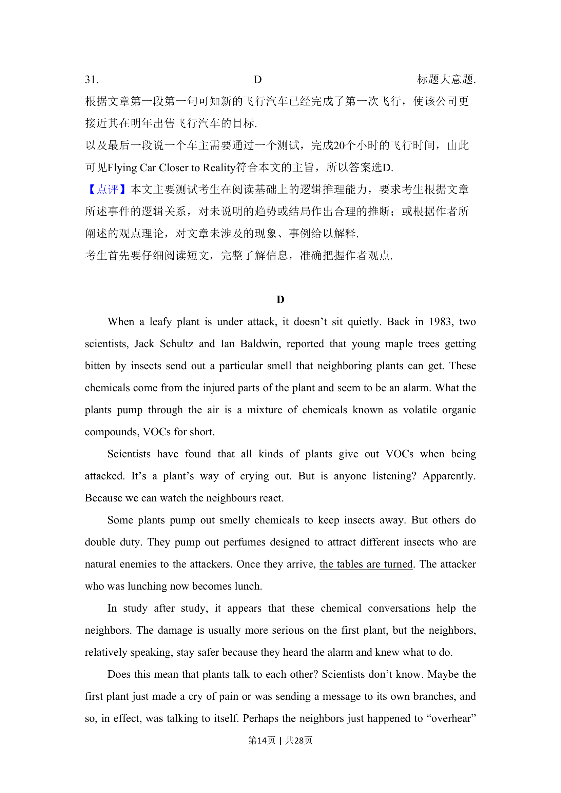
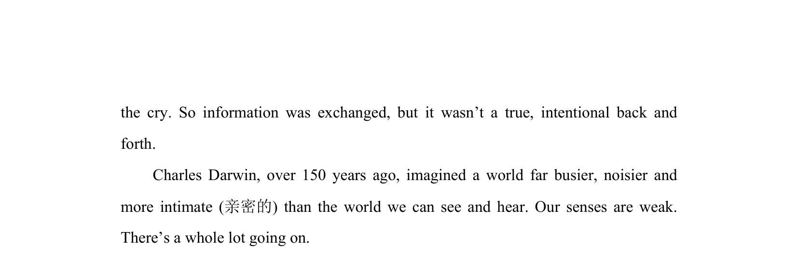

## 题面

## 摘要

阅读理解主旨题，文章介绍飞行汽车Transition的研发，考查文章最佳标题（飞行汽车越来越接近现实等）。

## 关联考点

- [[724-reading comprehension|阅读理解]]
- [[741-主旨大意|主旨大意]]
- [[550-说明文|说明文]]

## 答案与解析

> 📄 原 PDF 第 13 页：`素材/真题/吉林/2008-2024·（吉林）英语高考真题/2017年高考英语试卷（新课标Ⅱ卷）（解析卷）.pdf`
