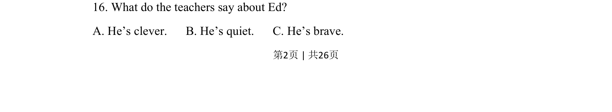

## 题面

## 摘要

听力理解题，考查教师对Ed学生的评价（聪明/安静/勇敢），属于短对话细节信息提取。

## 关联考点

- [[644-听力说明|听力理解]]
- [[690-Specific Information|细节理解]]
- [[988-短对话|短对话]]

## 答案与解析

> 📄 原 PDF 第 2 页：`素材/真题/吉林/2008-2024·（吉林）英语高考真题/2018年高考英语试卷（新课标Ⅱ卷）（解析卷）.pdf`
