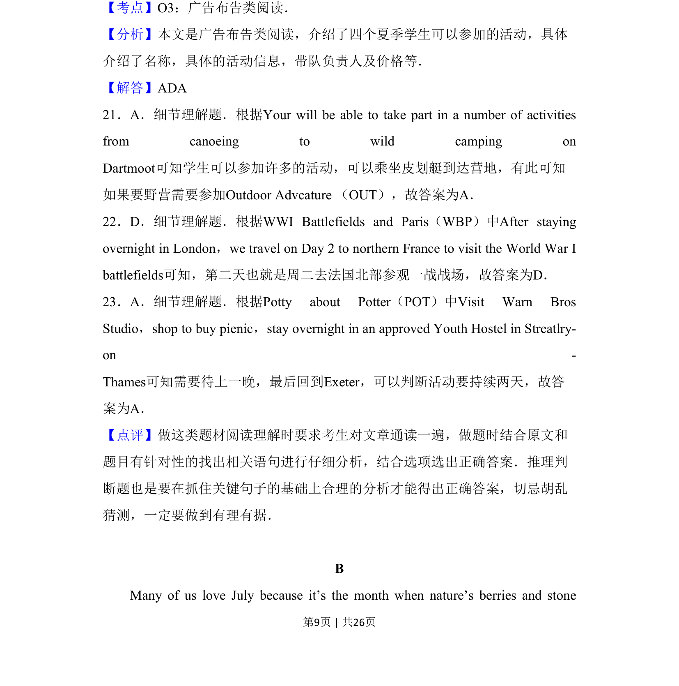
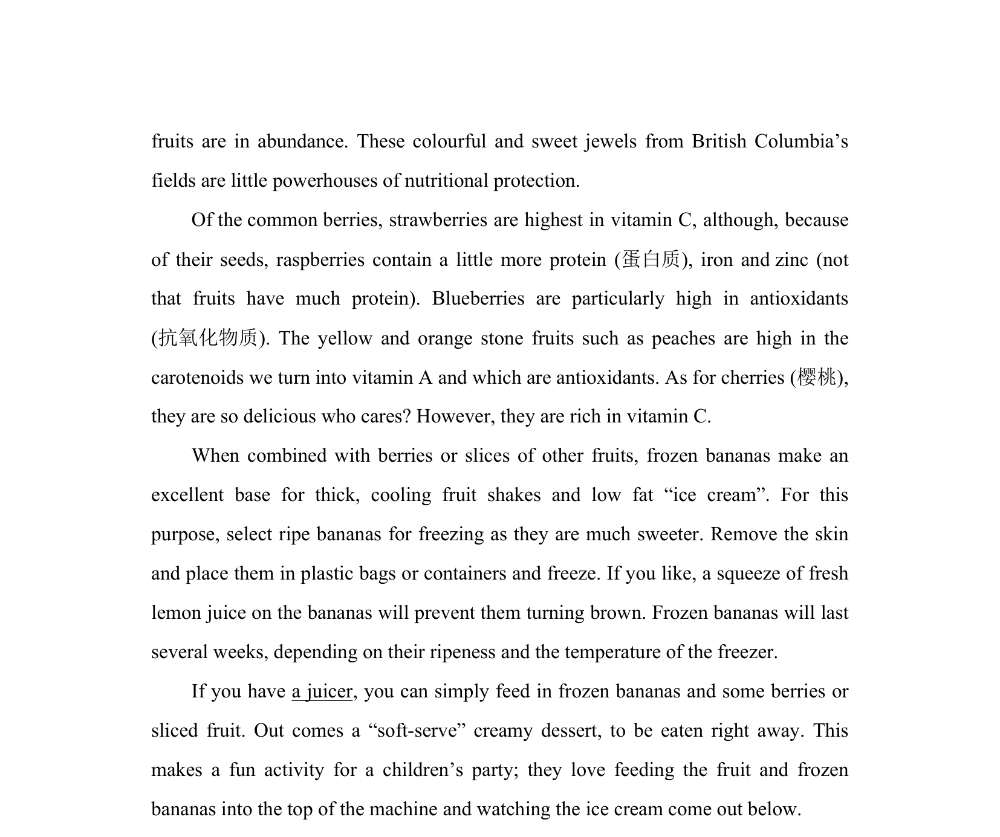

## 题面

## 摘要

本文考查学生阅读英文广告布告并提取具体信息的能力。

## 关联考点

- [[943-广告布告类阅读|广告布告类阅读]]
- [[689-Specific Information|细节理解]]

## 答案与解析

> 📄 原 PDF 第 9 页：`素材/真题/吉林/2008-2024·（吉林）英语高考真题/2018年高考英语试卷（新课标Ⅱ卷）（解析卷）.pdf`
