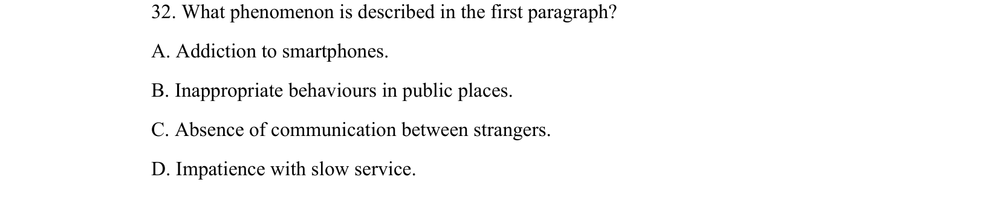

## 题面

## 摘要

阅读理解细节题，文章讨论低头族现象，考查文章第一段描述的现象（智能手机成瘾/公共场所不当行为等）。

## 关联考点

- [[725-reading comprehension|阅读理解]]
- [[690-Specific Information|细节理解]]
- [[175-议论文入门|议论文]]

## 答案与解析

> 📄 原 PDF 第 15 页：`素材/真题/吉林/2008-2024·（吉林）英语高考真题/2018年高考英语试卷（新课标Ⅱ卷）（解析卷）.pdf`
