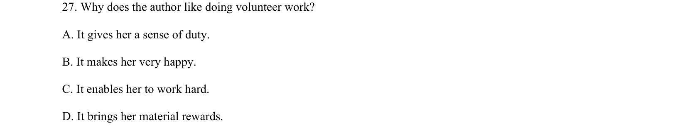
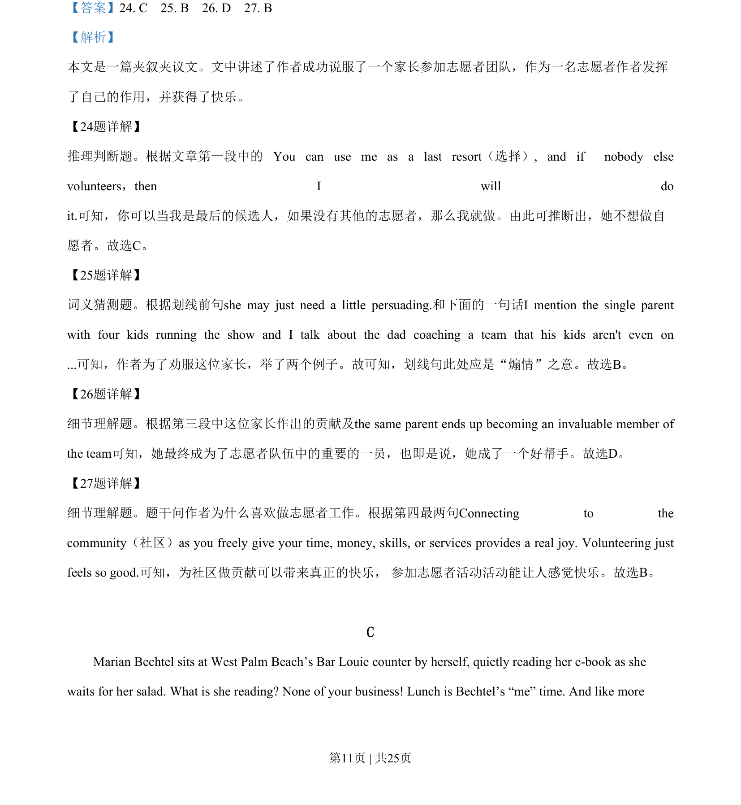
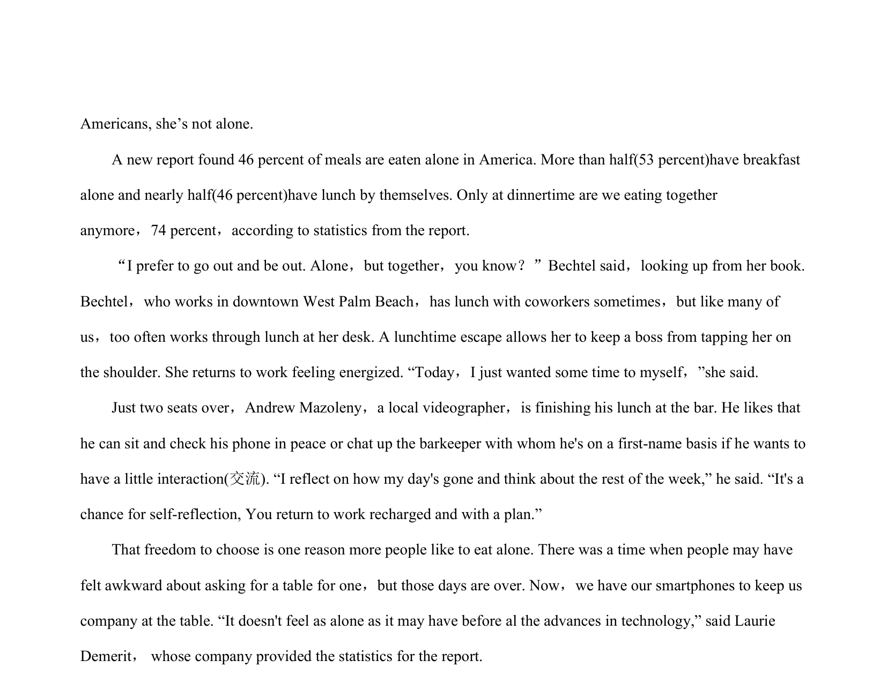

## 题面

## 摘要

阅读理解细节推理题，文章叙述作者参加志愿者工作的经历，考查作者喜欢做志愿服务的原因（带来快乐等）。

## 关联考点

- [[725-reading comprehension|阅读理解]]
- [[888-推理判断|推理判断]]
- [[146-记叙文要素|记叙文]]

## 答案与解析

> 📄 原 PDF 第 11 页：`素材/真题/吉林/2008-2024·（吉林）英语高考真题/2019年高考英语试卷（新课标Ⅱ卷）（解析卷）.pdf`
