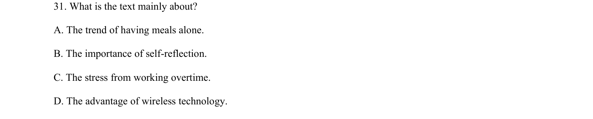
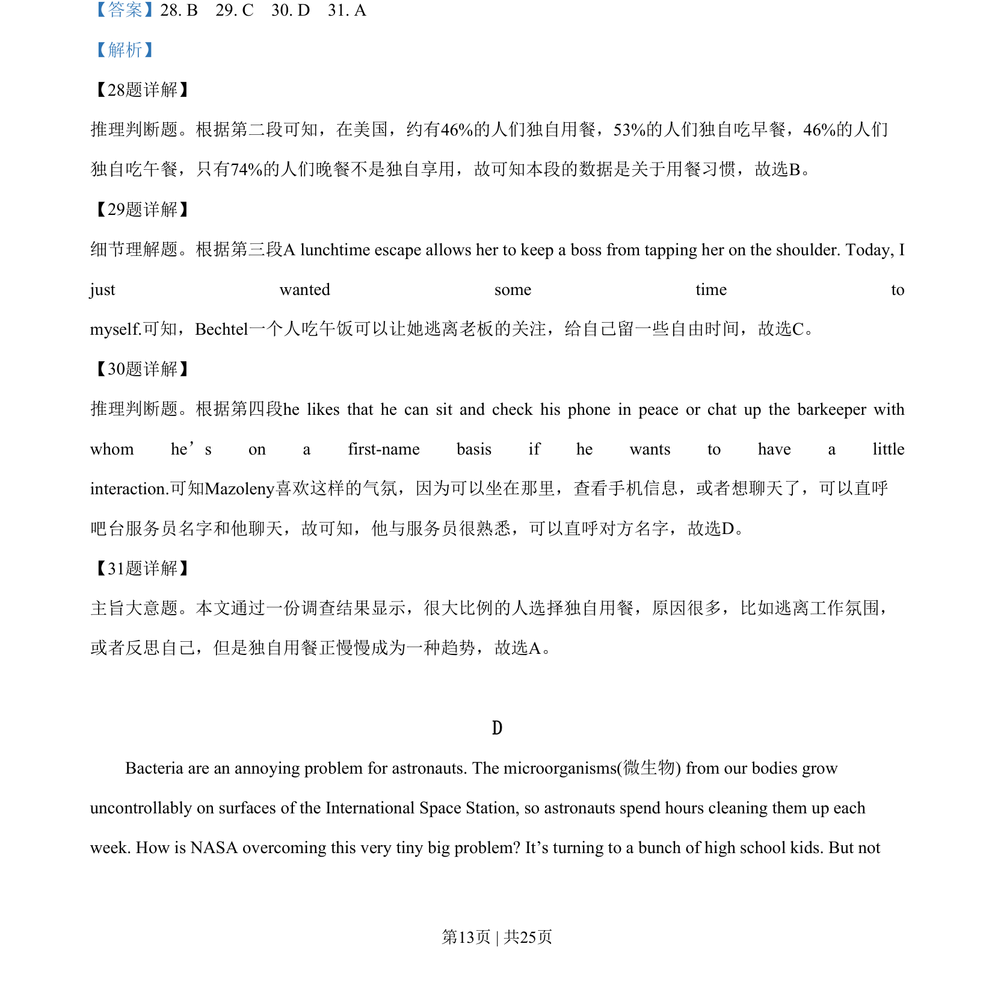
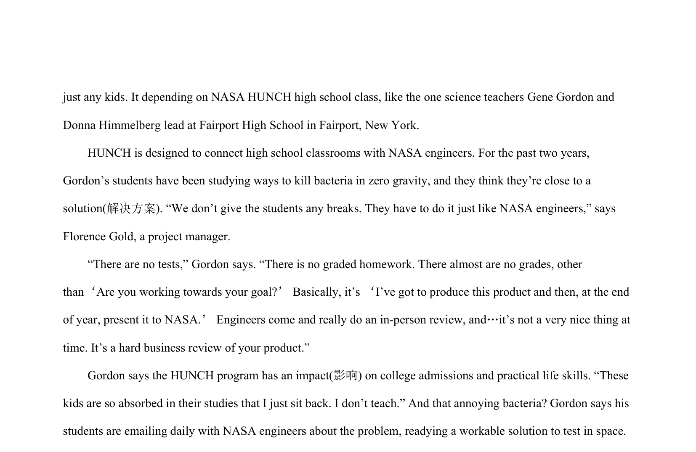

## 题面

## 摘要

本文通过数据说明美国人独自用餐的趋势及原因。

## 关联考点

- [[887-推理判断|推理判断]]
- [[689-Specific Information|细节理解]]
- [[741-主旨大意|主旨大意]]

## 答案与解析

> 📄 原 PDF 第 13 页：`素材/真题/吉林/2008-2024·（吉林）英语高考真题/2019年高考英语试卷（新课标Ⅱ卷）（解析卷）.pdf`
