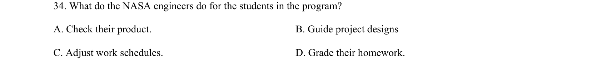

## 题面

## 摘要

阅读理解细节题，考查NASA工程师在HUNCH项目中对学生的帮助（检查成果/指导项目设计等）。

## 关联考点

- [[725-reading comprehension|阅读理解]]
- [[690-Specific Information|细节理解]]
- [[550-说明文|说明文]]

## 答案与解析

> 📄 原 PDF 第 14 页：`素材/真题/吉林/2008-2024·（吉林）英语高考真题/2019年高考英语试卷（新课标Ⅱ卷）（解析卷）.pdf`
