## 题面

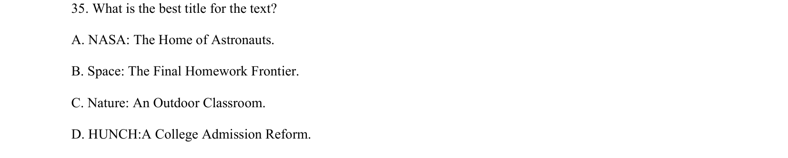

## 摘要

本文介绍HUNCH项目将空间技术带入课堂，考查细节理解、推理判断与主旨大意。

## 关联考点

- [[707-detail comprehension|detail comprehension]]
- [[713-inferential reasoning|inferential reasoning]]
- [[518-概括|main idea]]

## 答案与解析

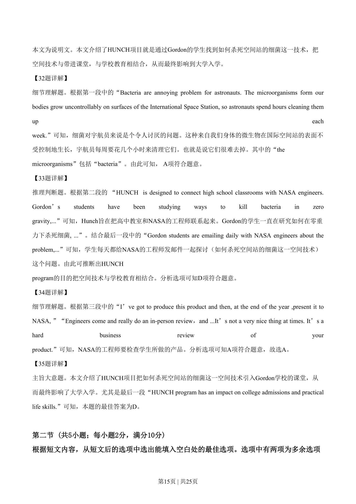
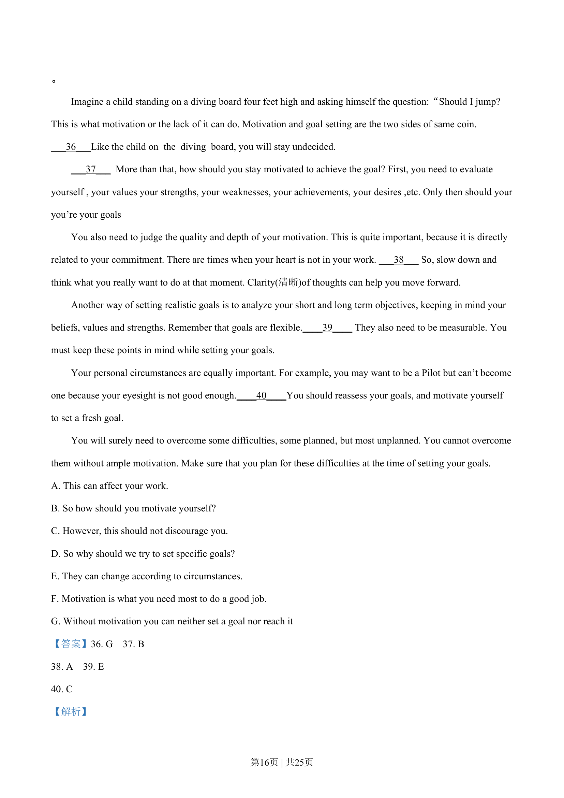
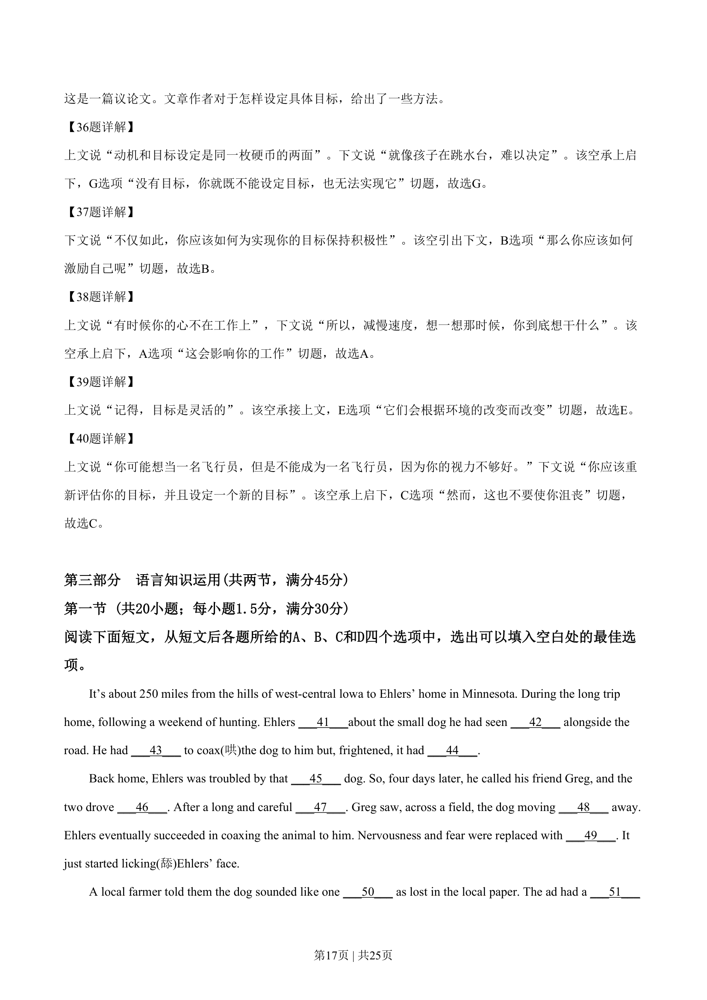
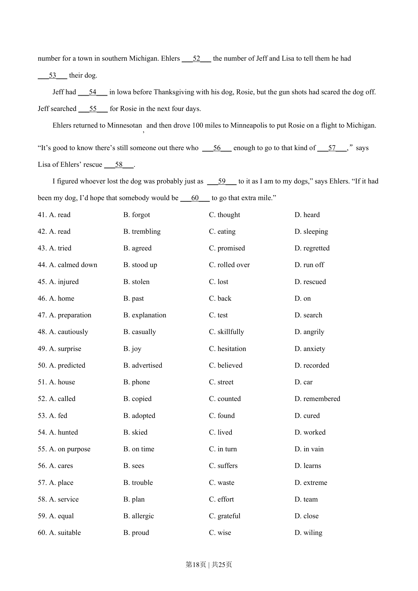
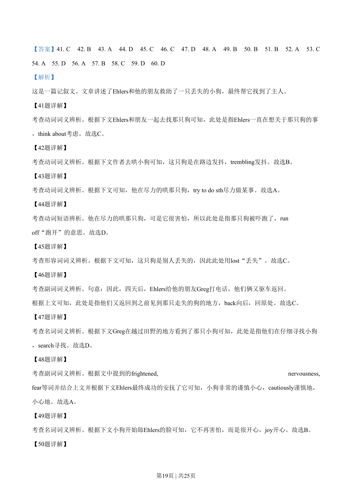
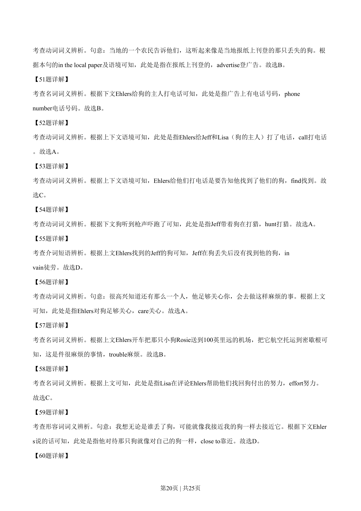
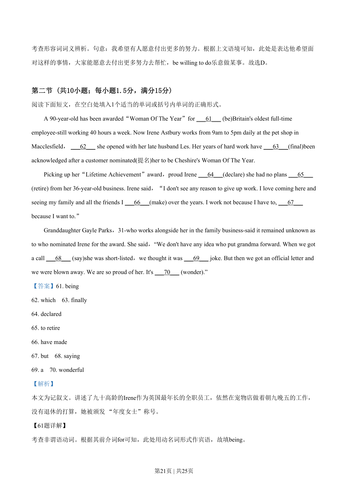
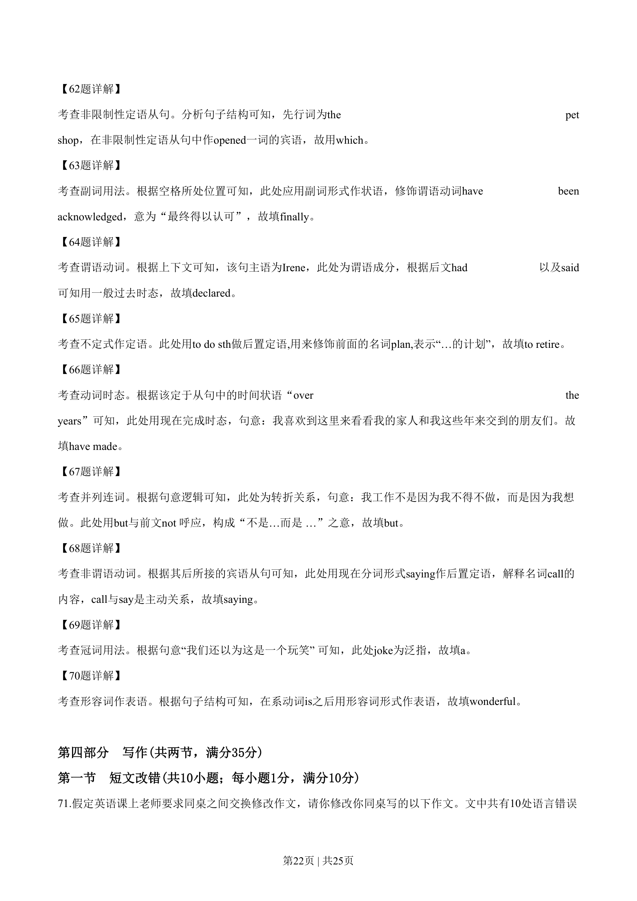
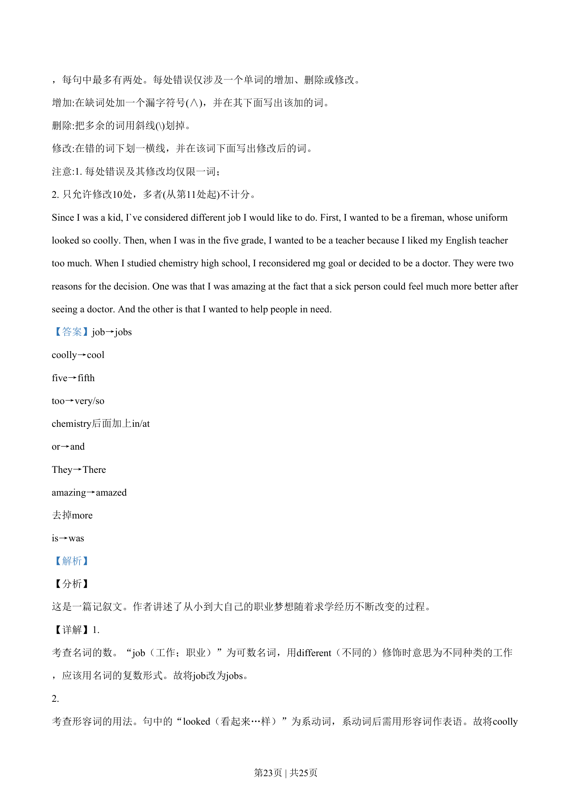
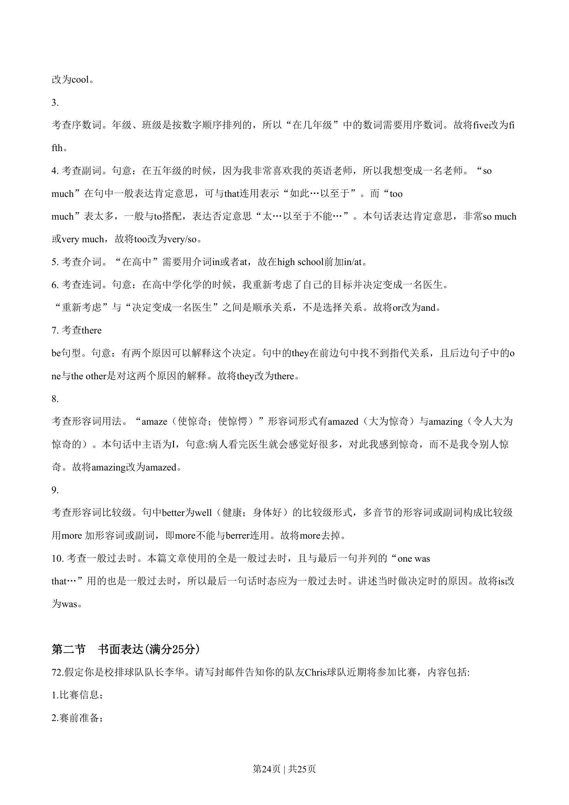
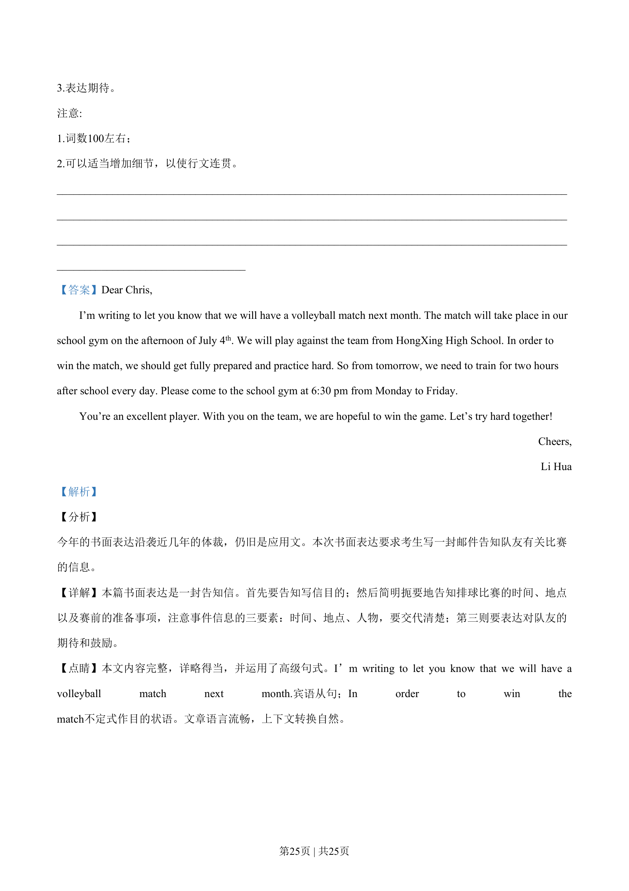

> 📄 原 PDF 第 14 页：`素材/真题/吉林/2008-2024·（吉林）英语高考真题/2019年高考英语试卷（新课标Ⅱ卷）（解析卷）.pdf`
