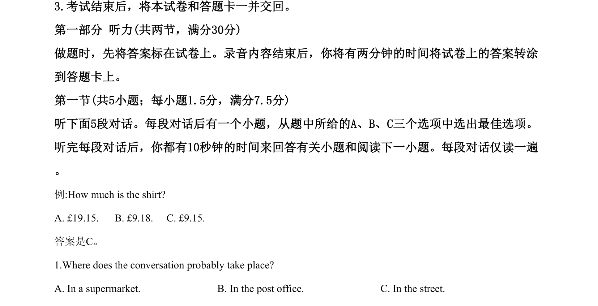

## 题面

## 摘要

听力短对话，考查地点推断、行为细节和职业判断。

## 关联考点

- [[716-listening comprehension|listening comprehension]]
- [[627-inference|inference]]
- [[708-detail|detail]]

## 答案与解析

> 📄 原 PDF 第 1 页：`素材/真题/吉林/2008-2024·（吉林）英语高考真题/2020年高考英语试卷（新课标Ⅱ卷）（解析卷）.pdf`
