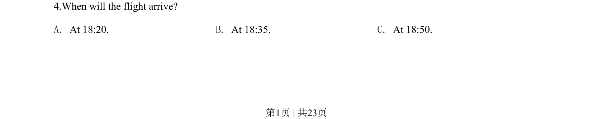

## 题面

## 摘要

考查航班到达时间细节，需听辨对话中关于延误的时间信息。

## 关联考点

- [[657-时间数字|时间数字]]
- [[689-Specific Information|细节理解]]
- [[642-听力短对话|听力短对话]]

## 答案与解析

> 📄 原 PDF 第 1 页：`素材/真题/吉林/2008-2024·（吉林）英语高考真题/2020年高考英语试卷（新课标Ⅱ卷）（解析卷）.pdf`
