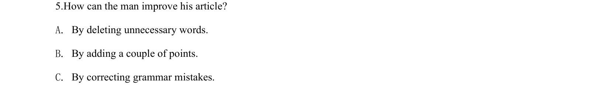
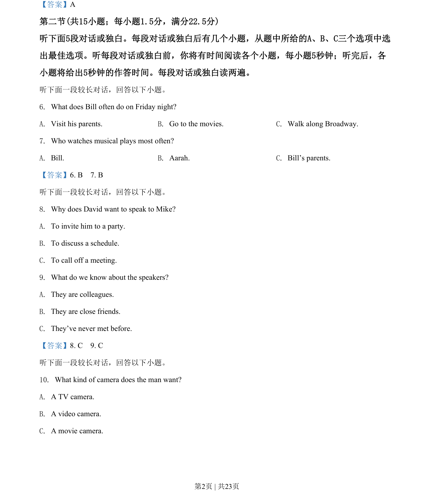

## 题面

## 摘要

男士询问如何改进文章，女士建议删除不必要的词语。

## 关联考点

- [[644-听力说明|听力理解]]
- [[730-understanding suggestions|understanding suggestions]]
- [[707-detail comprehension|detail comprehension]]

## 答案与解析

> 📄 原 PDF 第 2 页：`素材/真题/吉林/2008-2024·（吉林）英语高考真题/2020年高考英语试卷（新课标Ⅱ卷）（解析卷）.pdf`
