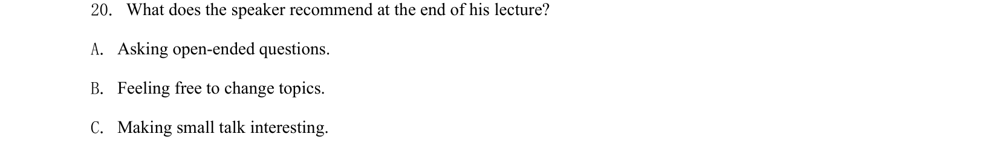
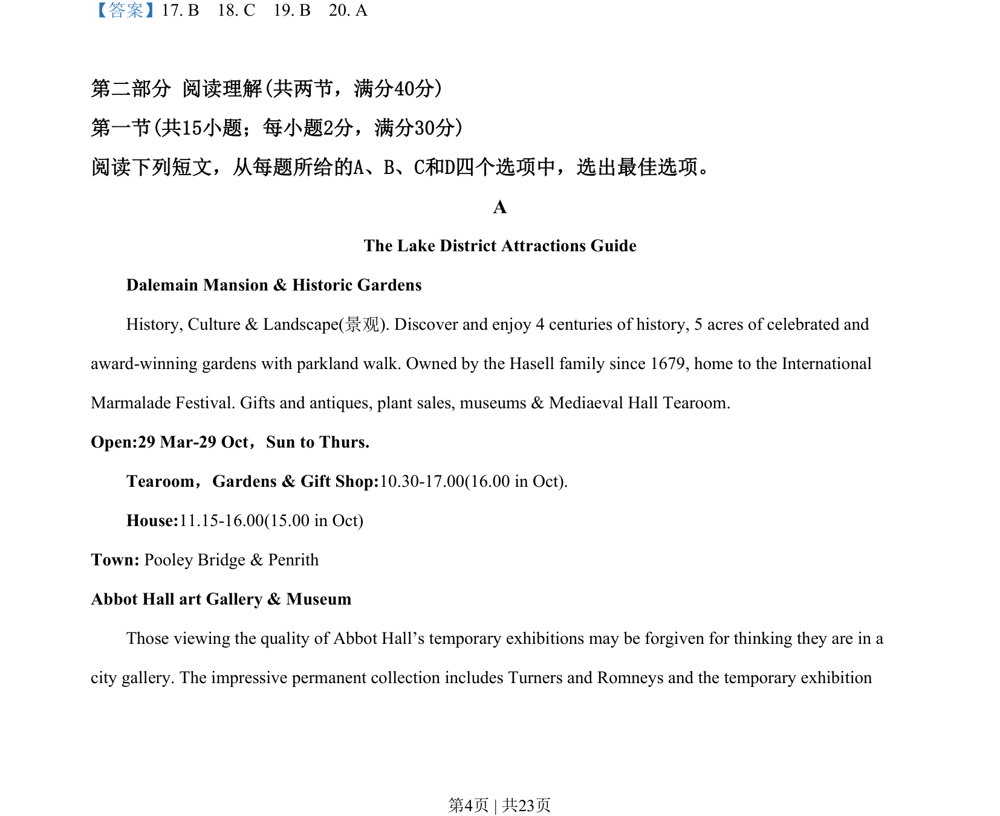

## 题面

## 摘要

听力题询问演讲者结尾的建议，考查细节理解与信息定位。

## 关联考点

- [[717-listening comprehension|listening comprehension]]
- [[708-detail understanding|detail understanding]]
- [[347-recommend-高中|recommendation]]

## 答案与解析

> 📄 原 PDF 第 4 页：`素材/真题/吉林/2008-2024·（吉林）英语高考真题/2020年高考英语试卷（新课标Ⅱ卷）（解析卷）.pdf`
