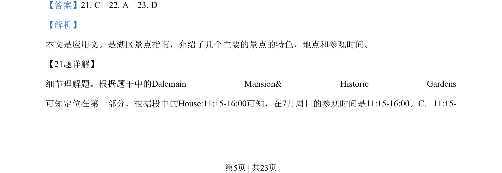

## 题面

## 摘要

短文阅读细节理解题，考查景点参观时间和艺术家作品信息定位。

## 关联考点

- [[724-reading comprehension|阅读理解]]
- [[878-细节定位|细节定位]]

## 答案与解析

> 📄 原 PDF 第 5 页：`素材/真题/吉林/2008-2024·（吉林）英语高考真题/2020年高考英语试卷（新课标Ⅱ卷）（解析卷）.pdf`
