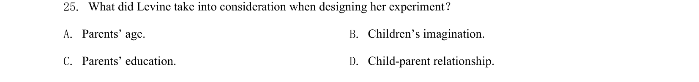

## 题面

## 摘要

该题考查对实验设计因素的细节理解能力，需在文中定位相关信息。

## 关联考点

- [[690-Specific Information|细节理解]]
- [[634-信息定位|信息定位]]

## 答案与解析

> 📄 原 PDF 第 7 页：`素材/真题/吉林/2008-2024·（吉林）英语高考真题/2020年高考英语试卷（新课标Ⅱ卷）（解析卷）.pdf`
