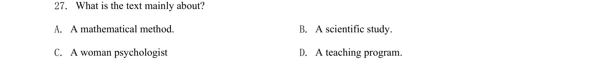
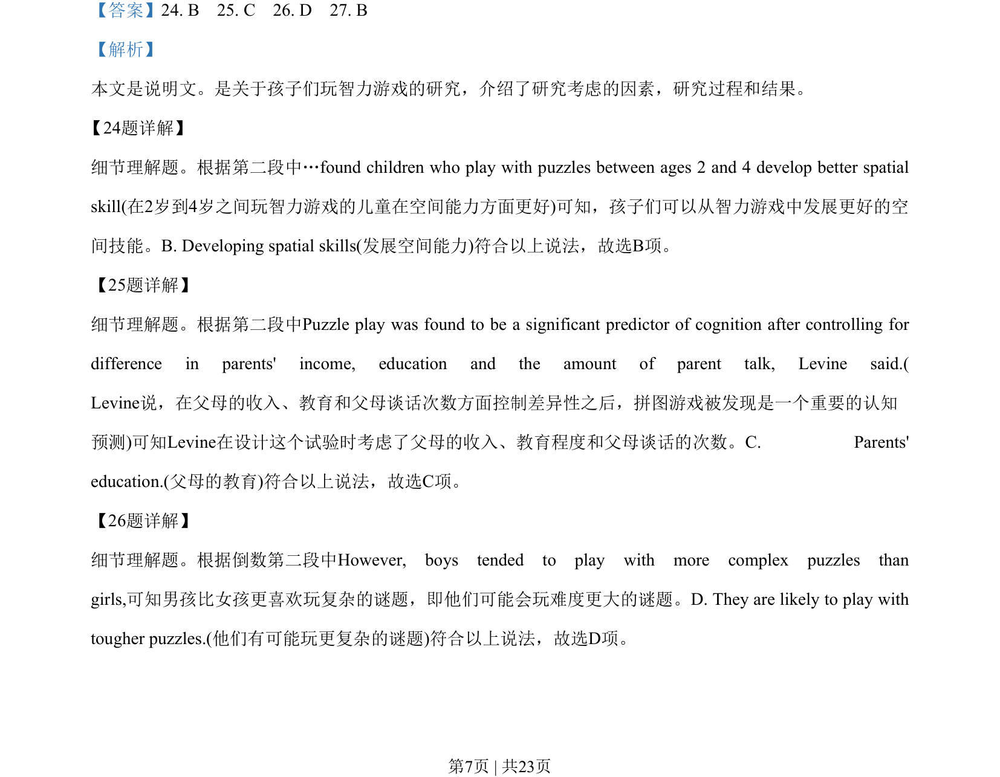
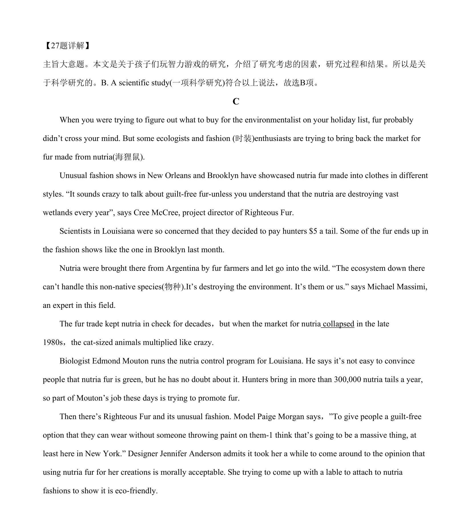

## 题面

## 摘要

考查说明文细节理解与主旨大意，涉及脑力游戏对儿童空间技能影响的研究。

## 关联考点

- [[689-Specific Information|细节理解]]
- [[741-主旨大意|主旨大意]]
- [[689-Specific Information|事实细节]]

## 答案与解析

> 📄 原 PDF 第 7 页：`素材/真题/吉林/2008-2024·（吉林）英语高考真题/2020年高考英语试卷（新课标Ⅱ卷）（解析卷）.pdf`
