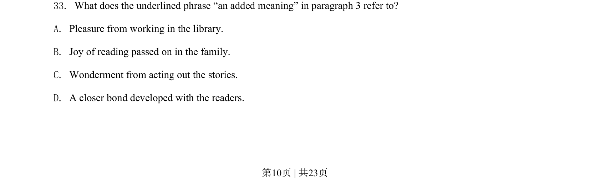

## 题面

## 摘要

阅读理解词义理解题，考查第三段中'an added meaning'的含义（家庭代代相传的阅读之乐等）。

## 关联考点

- [[724-reading comprehension|阅读理解]]
- [[980-词义猜测|词义猜测]]
- [[146-记叙文要素|记叙文]]

## 答案与解析

> 📄 原 PDF 第 10 页：`素材/真题/吉林/2008-2024·（吉林）英语高考真题/2020年高考英语试卷（新课标Ⅱ卷）（解析卷）.pdf`
