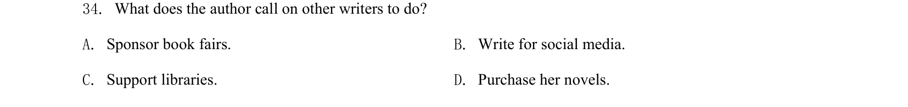

## 题面

## 摘要

阅读理解细节题，文章呼吁作家支持图书馆，考查作者号召其他作家做什么（赞助书展/为社交媒体写作/支持图书馆/购买书籍）。

## 关联考点

- [[阅读理解]]
- [[细节理解]]
- [[146-记叙文要素|记叙文]]

## 答案与解析

> 📄 原 PDF 第 11 页：`素材/真题/吉林/2008-2024·（吉林）英语高考真题/2020年高考英语试卷（新课标Ⅱ卷）（解析卷）.pdf`
