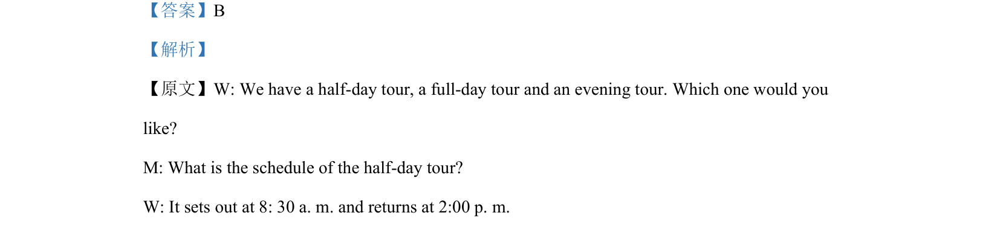

## 题面

## 摘要

该题为听力细节推断题，根据男方询问半天游安排可推断其兴趣所在。

## 关联考点

- [[941-听力推理|听力推理]]
- [[689-Specific Information|细节理解]]

## 答案与解析

> 📄 原 PDF 第 2 页：`素材/真题/吉林/2008-2024·（吉林）英语高考真题/2021年高考英语试卷（全国乙卷）（新课标Ⅰ）（解析卷）.pdf`
