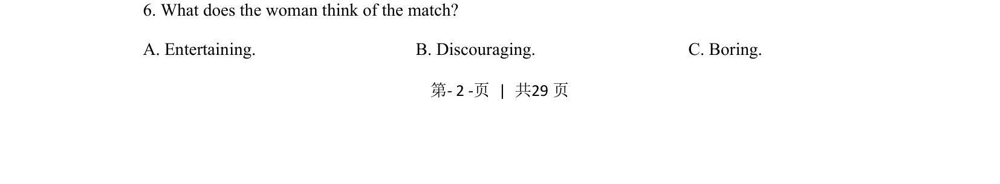

## 题面

## 摘要

本题考查通过听力对话推断女性对比赛的态度。

## 关联考点

- [[698-attitude inference|attitude inference]]
- [[706-detail comprehension|detail comprehension]]

## 答案与解析

> 📄 原 PDF 第 2 页：`素材/真题/吉林/2008-2024·（吉林）英语高考真题/2021年高考英语试卷（全国乙卷）（新课标Ⅰ）（解析卷）.pdf`
