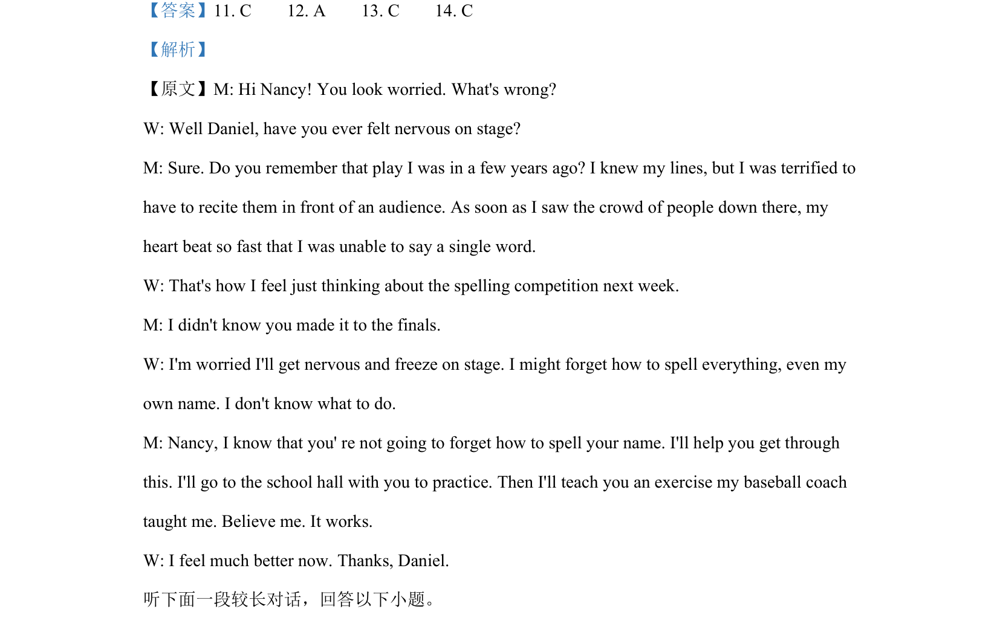

## 题面

## 摘要

对话探讨舞台紧张情绪，Daniel分享自身经历并安慰Nancy。

## 关联考点

- [[716-listening comprehension|listening comprehension]]
- [[976-emotion recognition|emotion recognition]]
- [[707-detail understanding|detail understanding]]
- [[627-inference|inference]]

## 答案与解析

> 📄 原 PDF 第 4 页：`素材/真题/吉林/2008-2024·（吉林）英语高考真题/2021年高考英语试卷（全国乙卷）（新课标Ⅰ）（解析卷）.pdf`
